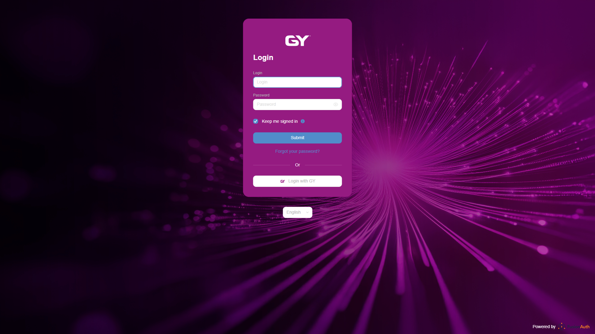

# Test Report: Katrin Vogel — 2026-08-28

## Summary
- **Journey tested:** First login at dev.wilken.ai (`journeys/katrin-vogel-journey.md`)
- **URL:** https://dev.wilken.ai/ → redirects to https://iam.latest.dev-wanyplace.de
- **Date:** 2026-08-28
- **Persona:** Katrin Vogel, 29, administrative clerk, first day on the job, medium technical affinity
- **Result:** ⚠️ Passed with problems
- **Duration:** 2m 52s (14:45:26 – 14:48:18)
- **Playwright actions:** 27
- **Scope tested:** Steps 1–6. Steps 7–8 **not executed** (no valid credentials available — see journey preconditions).
- **Requested restriction:** The "Forgot password?" form was **only inspected, never submitted**.

## Overall impression from the persona's perspective

I type in the address IT wrote down for me — `dev.wilken.ai` — and a second later I land on `iam.latest.dev-wanyplace.de`, a bright purple page with a logo that says "GY". The word "Wilken" appears nowhere. Bottom right it says "Powered by FusionAuth", a third name I don't recognise. On my first day, when everyone has just told me to watch out for phishing, this is exactly the moment where I'd rather ask someone than type in my password.

The form itself is plain and actually understandable — two fields, one button. But underneath it there are two login paths side by side ("Submit" and "Login with GY") without a single word about which one applies to me. I have an email address and a password from IT, so I'll take the top one — but I'm not sure, and if it's wrong I may have just burned a failed attempt.

The language was confusing too: the form was in German, but the selector below it said "English". I clicked "Deutsch" and visibly nothing happened — because it was already German. For a moment I thought the page had stopped responding.

On the positive side: the forgot-password page was better than I'd feared — it explains in one sentence what to do, and there's a way back to the login. Overall I could probably log in here, but I'd have called IT first. And that's exactly what I was trying to avoid.

## Problems found

### Problem 1: No visible reference to the company or application — looks like phishing
- **Severity:** Critical
- **Step:** Steps 1 and 2
- **Expected:** The login page is recognisably tied to the application Katrin opened (name, logo, or at least a hint such as "Sign in to …").
- **Actual:** After opening `dev.wilken.ai`, the domain `iam.latest.dev-wanyplace.de` appears with a "GY" logo. Inspecting the page source showed: the word "Wilken" occurs on the entire page **exactly once** — buried in the `redirect_uri` query parameter of a link. It appears **nowhere** as visible text. On top of that, "Powered by FusionAuth" in the bottom right adds a third unfamiliar name.
- **Persona's reaction:** Suspicious to alarmed. Katrin stops and asks IT whether the page is genuine — precisely the call she wanted to avoid. In the worse case, she gets used to entering credentials on unfamiliar-looking domains.
- **Screenshot:** 

### Problem 2: Language selector shows "English" while the form is German
- **Severity:** Medium
- **Step:** Step 3
- **Expected:** The language selector reflects the language the form is actually rendered in.
- **Actual:** On first load the entire form is German ("Anmelden / E-Mail / Passwort / Absenden"), but the language selector reads **"English"** (`select.value = "en"`, and `<html lang="en">` as well). Clicking "Deutsch" changes nothing visible — it was already German. Only an explicit selection brings display and content back in sync: "English" then correctly switches to English, "Deutsch" switches back.
- **Persona's reaction:** Brief irritation, then the impression that the page isn't responding to her click. She may click repeatedly.
- **Screenshot:** 

### Problem 3: The German and English versions ask for different things
- **Severity:** Medium
- **Step:** Step 3
- **Expected:** Both language versions label the same field identically.
- **Actual:** In German the first field is called **"E-Mail"**; in English it is **"Login"** (with the heading also "Login", producing "Login / Login / Password"). The German version therefore clearly says "enter your email address", while the English one leaves open whether a username or an email is expected. The "Login with GY" button remains untranslated English in both languages.
- **Persona's reaction:** If she ends up in the English version by accident, she doesn't know whether to enter her email address or a username — and will likely try both.

### Problem 4: "Login with GY" with no explanation whatsoever
- **Severity:** Medium
- **Step:** Step 4
- **Expected:** It should be recognisable what the second login option is for and who should use it.
- **Actual:** The button carries only the label "Login with GY". Inspection showed: **no** `title`, **no** `aria-label`, **no** `aria-describedby`, no tooltip, no explanatory text. Nothing distinguishes the two paths for Katrin beyond the label itself.
- **Persona's reaction:** She guesses. If she picks wrong, she may read the outcome as "my password is wrong" and start an unnecessary password reset.

### Problem 5: "Keep me signed in" is enabled by default
- **Severity:** Medium
- **Step:** Step 2
- **Expected:** An option that keeps the session open long-term is **off** by default — particularly since its own hint warns against using it on shared devices.
- **Actual:** The "Angemeldet bleiben" ("Keep me signed in") checkbox is **already ticked** on load. The corresponding hint only appears on hovering the info icon and reads: *"Enable this option to stay signed in to FusionAuth for the configured duration. Do not select this on a public or shared device."* The warning thus contradicts the default — and names "FusionAuth" rather than the application Katrin is signing in to.
- **Persona's reaction:** She probably won't notice the tick at all. If she does, the warning adds to her uncertainty.

### Problem 6: No path for new users, no support contact, no legal notice
- **Severity:** Low (expected for a B2B system, but unaccompanied)
- **Step:** Step 6
- **Expected:** No self-registration, as expected — but a pointer to who to contact without access.
- **Actual:** The login page contains a total of **three** clickable elements: "Absenden", "Passwort vergessen?", "Login with GY". The forgot-password page contains **two**: "Absenden", "Zurück zur Anmeldung kehren". No registration, no "New here?", no support/IT contact, no legal notice (Impressum) and no privacy link.
- **Persona's reaction:** Without prior onboarding she would have no clue what to do — she'd have to guess that IT is responsible.

### Problem 7: Sloppy wording and an incorrect alt text
- **Severity:** Low
- **Step:** Steps 4 and 5
- **Expected:** Correct German labels; image alt texts that describe the image.
- **Actual:** The return link reads **"Zurück zur Anmeldung kehren"** (redundant in German; it should be "Zurück zur Anmeldung" or "Zur Anmeldung zurückkehren"). The browser tab of the German forgot-password page carries the English title **"Forgot Password"**. The logo inside the "Login with GY" button has the alt text **"OpenID Connect Logo"** but actually renders the file `GY_gyiolet.svg` — so screen reader users hear something different from what is shown.
- **Persona's reaction:** Katrin barely notices, but it reinforces the overall unfinished impression.

## Positive observations

- The **forgot-password page is better than the preliminary research suggested**: it includes an explanatory sentence ("Enter your email address in the form below to reset your password."), a clearly marked required field ("E-Mail \*"), and a return link. The journey expected an uncommented single-field form here.
- The **return to login works** and the previously chosen language is preserved.
- The **browser back button works** cleanly across both domains (login → forgot password → login), with no error page or redirect loop.
- The form is **short and uncluttered** — only two fields, no superfluous input.

## Steps executed

| Step | Description | Status | Note |
|------|-------------|--------|------|
| 1 | Open https://dev.wilken.ai/ | ✅ | Redirect to `iam.latest.dev-wanyplace.de` happens as expected — but with no recognisable link to the company (Problem 1) |
| 2 | Inspect the login form | ✅ | All expected elements present; "Keep me signed in" pre-ticked, however (Problem 5) |
| 3 | Check and switch language | ⚠️ | Switching works, but the initial state is inconsistent (Problem 2) and the versions differ in substance (Problem 3) |
| 4 | Evaluate the second login option "Login with GY" | ⚠️ | Present, but with no explanation at all (Problem 4) |
| 5 | Inspect "Forgot password?" (without submitting) | ✅ | Form opened and documented, **not submitted**. Better than expected (see "Positive observations") |
| 6 | Look for a path for new users | ✅ | As expected, none present — but no substitute guidance either (Problem 6) |
| 7 | Log in with real credentials | ⬜ | **Not executed** — no valid credentials available |
| 8 | First view after login | ⬜ | **Not executed** — depends on step 7 |

## Edge cases

| Edge case | Status | Result |
|-----------|--------|--------|
| Browser "back" during the redirect between domains | ✅ tested | Works without errors across both domains; language choice is preserved |
| Behaviour on a wrong password | ⬜ not tested | Not executed — no credentials were deliberately submitted to the login form |
| Session duration with "Keep me signed in" | ⬜ not tested | Requires a successful login (step 7) |

## Success criteria

| Criterion | Met? | Note |
|-----------|------|------|
| Katrin recognises without confusion that the unfamiliar domain belongs to the right login | ❌ | No visible reference to the company or application — the journey's central breach of trust |
| She could make an informed choice between the two login options | ❌ | No explanation of "Login with GY" whatsoever |
| The language switch works predictably | ⚠️ | Switching works technically, but the initial state and field labels are contradictory |
| She would know what to do next if she forgot her password | ⚠️ | The page explains what to enter — but not what happens afterwards (will an email arrive? when? what if the address is unknown?) |
| No critical errors on the tested pages | ✅ | No technical errors, no error pages, no broken links |

## Recommendations

1. **Make the company reference visible (highest priority).** Show the application name or "Wilken" as visible text or a logo on the login page — e.g. a line reading "Sign in to \<application name\>". Without it, the page is indistinguishable from a phishing page.
2. **Label the two login paths.** Short lines such as "Sign in with your \<company\> account" above the form and "Sign in with your GY account — for employees of …" above the button. One sentence per option is enough.
3. **Synchronise default language and language selector.** The selector value (and `<html lang>`) must reflect the language actually rendered; ideally the browser language is evaluated and the selector pre-set accordingly.
4. **Align field labels across languages.** If an email address is expected, the English field should read "Email", not "Login". Translate "Login with GY" into German.
5. **Disable "Keep me signed in" by default.** The default contradicts the tool's own tooltip warning. Also use the application name instead of "FusionAuth" in the hint text.
6. **Add guidance for users without access.** A line such as "No account yet? Please contact your IT department." below the form — plus legal notice/privacy links where required for the audience.
7. **Extend the password reset with follow-up information.** One sentence about what happens after submitting ("You will receive an email with a link within a few minutes…") removes the uncertainty before clicking.
8. **Fix the small things.** "Zurück zur Anmeldung kehren" → "Zurück zur Anmeldung"; translate the tab title of the German page; change the GY logo's alt text from "OpenID Connect Logo" to "GY Logo".

## Open items for the next test run

- Steps 7–8 of the journey remain **unobserved**. Once valid test credentials are available (per the journey, to be passed directly in the prompt, never written to a file), the persona `katrin-vogel-persona.md` should be extended with real in-app goals and the journey re-run from step 7.
- The edge case "error message on a wrong password" was deliberately skipped and can be added on explicit approval.
