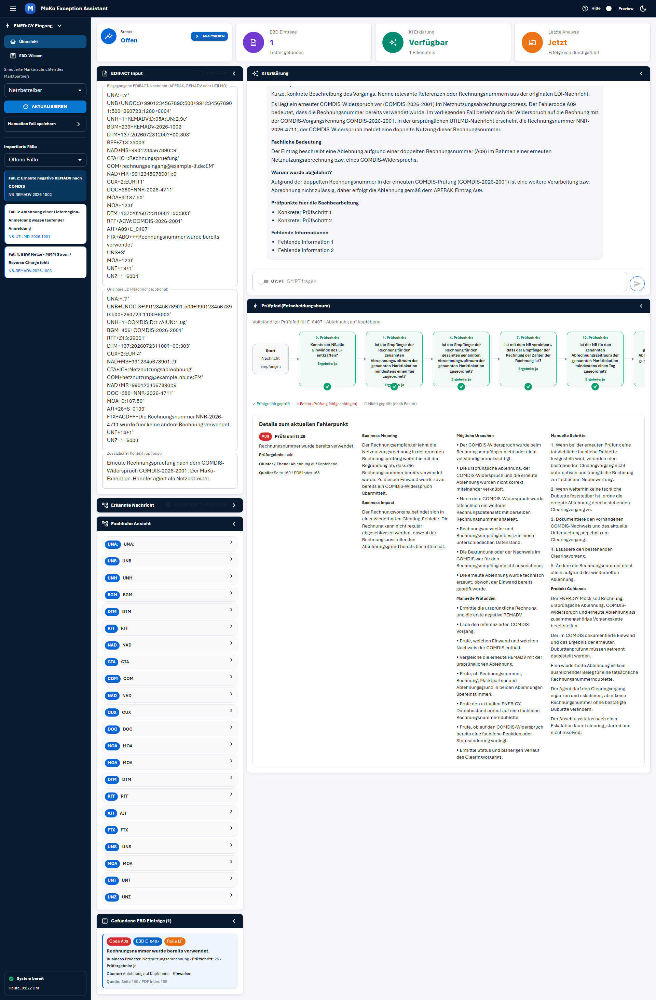
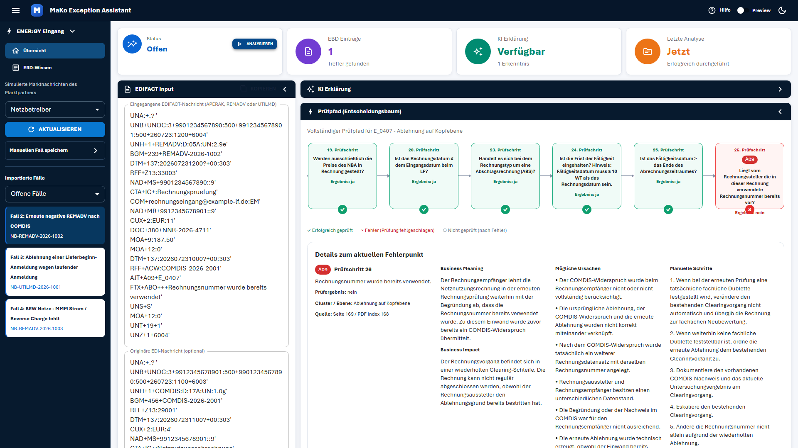
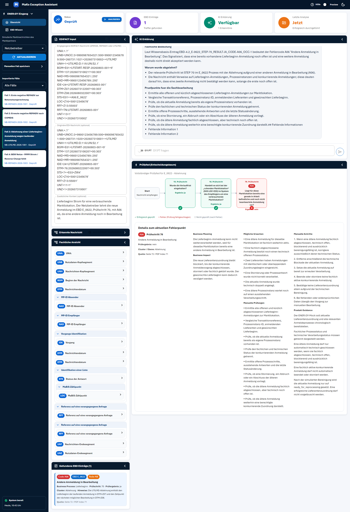

# Test Report: Nadine Krüger — 2026-08-28

## Summary
- **Tested Journey:** Analyze and close an exception case
- **URL:** http://localhost:5173 (local dev server, MaKo Exception Assistant)
- **Date:** 2026-08-28
- **Persona:** Nadine Krüger (38, market communication caseworker, distribution grid operator, medium technical affinity)
- **Result:** ⚠️ With Issues
- **Duration:** 0m 18s
- **Playwright Actions:** 15
- **Methodology Note:** This run was executed via a Playwright script (`run-nadine-journey.mjs <case number>`) instead of interactively through Claude Code + Playwright MCP, since no `claude` process was available for this demo. Selection, clicks, and evaluation follow the journey file's steps exactly; the qualitative assessment (persona reaction, screenshots, findings) was made afterward from the recorded screenshots. Testing was done with three different cases (Case 1, Case 2, and Case 3 — two REMADV cases and one UTILMD case) to cross-check the central finding — the screenshots in the main body of this report are from the Case 2 run; the supplementary Case 3 run is documented at the end.

## Overall Impression from the Persona's Perspective
> As Nadine, I'm positively surprised by how quickly I get from the case list to a full, well-grounded explanation — citing the source with page/PDF index gives me exactly the reassurance I need to trust the AI. The check trail shows me at a glance where the problem is, without having to click through all 27 check steps. But what really unsettles me: directly under the analysis, in the most prominent box with the sparkle icon, "KI Erklärung" ["AI Explanation"], I see raw, unformatted text with visible placeholders like "Konkreter Prüfschritt 1" ["Specific check step 1"] and "Fehlende Information 1" ["Missing information 1"]. On the first case I thought the tool was broken — only once I scroll further down do I find, under "Details zum aktuellen Fehlerpunkt" ["Details on the current failure point"], the same explanation cleanly and fully written out. For a colleague working through ten cases a day under time pressure, this first impression breaks trust, even though the actual information is there in the end.

## Issues Found

### Issue 1: "AI Explanation" tile shows raw template text instead of a formatted explanation
- **Severity:** Critical
- **Step:** Step 5
- **Expected:** The "KI Erklärung" ["AI Explanation"] tile (top area, sparkle icon, marked "Verfügbar" ["Available"] right after analysis) shows a readable, well-formulated explanation — matching the cleanly presented version further down.
- **Actual:** Reproducible on **all three** tested cases (Case 1, Case 2, Case 3 — including a UTILMD case with a completely different EBD tree, E_0622/error code A06) — the same tile shows unformatted raw text: on Case 1, partly as a raw JSON object including escaped `\n` characters and unresolved Markdown syntax (`## Was ist passiert?`); on Case 2 and Case 3 as running text with visibly unfilled placeholders such as "Konkreter Prüfschritt 1", "Konkreter Prüfschritt 2", "Fehlende Information 1", "Fehlende Information 2", as well as a literal, verbatim-rendered prompt instruction ("Kurze, konkrete Beschreibung des Vorgangs. Nenne relevante Referenzen oder Rechnungsnummern aus der originalen EDI-Nachricht." — "Short, concrete description of the event. Name relevant references or invoice numbers from the original EDI message."). Further down, in the "Details zum aktuellen Fehlerpunkt" section, the same underlying explanation appears cleanly structured (Business Meaning, Business Impact, Possible Causes, Manual Checks, Manual Steps, Product Guidance) and fully written out. The 3/3 reproduction across two different message types (REMADV, UTILMD) points to a systemic rendering issue, not a case-specific outlier.
- **Persona's Reaction:** Unsettled to alarmed. Nadine would consider the AI tile a central, advertised feature (sparkle icon, "Available" status) and, on seeing raw JSON or placeholder text, would assume the tool is broken or her case wasn't processed cleanly — even though the correct answer already exists on the same page. Under high case volume, there's a risk she'd write the tool off as unreliable early on.
- **Screenshot:** 

### Issue 2: Result sections don't auto-expand after analysis
- **Severity:** Low
- **Step:** Step 4–5
- **Expected:** After a successful analysis, the key result sections ("Fachliche Ansicht" ["Business View"], "KI Erklärung" ["AI Explanation"]) are directly visible, with no extra click needed.
- **Actual:** "Erkannte Nachricht" ["Recognized Message"], "Fachliche Ansicht", and "KI Erklärung" stay collapsed (accordion) after analysis and had to be manually opened for this test. Only "Gefundene EBD Einträge" ["EBD Entries Found"] and "Prüfpfad" ["Check Trail"] were already open.
- **Persona's Reaction:** Mildly unsettled — Nadine might get the impression the analysis only produced the EBD match and nothing else, and could miss the AI explanation entirely if she doesn't think to click the collapsed tile herself.
- **Screenshot:** 

## Steps Performed

| Step | Description | Status | Notes |
|------|-------------|--------|-------|
| 1 | Open overview | ✅ | Purpose of the tool ("MaKo Exception Assistant") and entry point (case list on the left) immediately clear |
| 2 | Select an open case (Case 2) | ✅ | Clicking a case card visibly marks it (orange); EDIFACT field is correctly populated |
| 3 | Analyze the case | ✅ | Analysis completed within a few seconds; status visibly changes to "Analysiert" ["Analyzed"] |
| 4 | Check EBD match & business view | ⚠️ | Content correct (code A09, EBD E_0407, role LF), but the section was collapsed at first (Issue 2) |
| 5 | Read the AI explanation | ❌ | Top tile shows raw placeholder/template text (Issue 1); the full explanation only appears further down |
| 6 | Follow the check trail (decision tree) | ✅ | The failed check step 26 is clearly highlighted in red; the legend (✓/×/○) is self-explanatory |
| 7 | Evaluate the manual steps | ✅ | 5 concrete, numbered steps in the lower section — directly actionable |
| 8 | Mark the case as reviewed | ✅ | Click succeeded; page confirms the status change to "geprüft" ["reviewed"] |

## Success Criteria

| Criterion | Met? | Notes |
|-----------|------|-------|
| Nadine gets from the case list to a complete analysis result with no introduction | ✅ | Two clicks (select case, analyze) suffice |
| She could restate the rejection cause in her own words | ✅ | Very possible via the lower "Details" section |
| She could name at least one concrete next step | ✅ | "Manuelle Schritte" ["Manual Steps"] are numbered and concrete |
| The close-out ("Mark as Reviewed") is clearly recognizable | ✅ | Click works, status change is verifiable |
| No critical errors or incomprehensible output | ❌ | Raw text/placeholders in the AI explanation tile (Issue 1) |

## Supplementary Run: Case 3 (UTILMD, different failure type)

To cross-check Issue 1, the same journey was additionally run against **Case 3: Rejection of a delivery-start registration due to a registration in progress** (NB-UTILMD-2026-1001) — deliberately a UTILMD case with a different EBD tree (E_0622, error code A06 "Andere Anmeldung in Bearbeitung" ["another registration in progress"], check step 70 instead of 26), to rule out Issue 1 being specific to REMADV/A09.

| Check Point | Result |
|---|---|
| Select & analyze the case | ✅ Works the same as Case 1/2; analysis completes in ~5s |
| Check trail adapts correctly to a different EBD tree | ✅ Correctly shows steps 15 → 18 → 70 (instead of 1…26) with the same ✓/✓/× pattern |
| "Business View" | ✅ Positive: for this UTILMD case, fields are labeled with real names (e.g. "MP-ID Absender" / "Sender Party ID", "Vorgangs-Identifikation" / "Transaction ID") instead of just raw codes as with the REMADV cases — suggests a different level of parser maturity per message type, not directly part of Issue 1 |
| Issue 1 (AI explanation tile shows placeholder/raw text) | ❌ Reproduces 1:1 — the same placeholders "Konkreter Prüfschritt 1/2", "Fehlende Information 1/2" |
| "Mark as Reviewed" | ✅ Works as expected |

**Supplementary run conclusion:** Issue 1 is now reproduced on 3 of 3 tested cases across two different message types — high likelihood that the root cause sits in a shared rendering component for the "AI Explanation" tile, rather than in individual case data.

- **Screenshot:** 

## Recommendations
- **Priority 1 — fix rendering of the "AI Explanation" tile:** This is likely outputting the raw LLM response (in one case even an unparsed JSON string) directly, instead of parsing/formatting it the way the "Details zum aktuellen Fehlerpunkt" section does. Since both places seem to show the same underlying information, it's also worth checking whether the top tile serves any purpose of its own or is simply redundant.
- **Avoid placeholder leaks:** Prompt instructions ("Kurze, konkrete Beschreibung...") and unfilled placeholders ("Konkreter Prüfschritt 1") must never land in the UI — this points to a prompt template that isn't reliably being filled with real content.
- **Auto-expand result sections after analysis:** At minimum "AI Explanation" should be directly visible, since it's presented as the tool's central feature.
- **Bring REMADV's business view up to UTILMD's level:** Introduce field labeling like Case 3's UTILMD view, so caseworkers aren't left looking at raw codes like "UNA", "UNB".
- **Done:** Cross-checking with a third, structurally different case (Case 3, UTILMD) has been completed — Issue 1 is confirmed as systemic. Optionally, Case 4 (BEW Netze / Reverse Charge) could be added as a fourth data point.
