# Testreport: Nadine Krüger — 2026-08-28 (Lauf 2)

## Zusammenfassung
- **Getestete Journey:** Exception-Fall analysieren und abschließen (`nadine-krueger-journey.md`)
- **URL:** http://localhost:5173
- **Datum:** 2026-08-28
- **Persona:** Nadine Krüger, 38, Sachbearbeiterin Marktkommunikation / Rechnungsprüfung (`nadine-krueger-persona.md`)
- **Ergebnis:** ⚠️ Mit Problemen
- **Dauer:** 7m 43s (10:17:31 – 10:25:14 Uhr)
- **Playwright-Aktionen:** 57 (davon 3 fehlgeschlagen — siehe Problem 1)
- **Viewport:** 1920 × 1080 (laut Persona)

### Abweichung von der Journey
Die Journey nennt als Testfall „Fall 1: Erste negative REMADV zur Netznutzungsrechnung". Dieser Fall war beim Testbeginn bereits aus früheren Testläufen als **„Geprüft"** markiert, ebenso Fall 2 und Fall 3. Einziger offener Fall war **„Fall 4: BEW Netze – MMM Strom / Reverse Charge fehlt" (NB-REMADV-2026-1003)** — ebenfalls ein abgelehnter REMADV-Fall. Die Journey wurde daher mit Fall 4 durchgespielt; das Journey-Ziel (offenen REMADV-Fall auswählen, analysieren, verstehen, abschließen) bleibt unverändert.

---

## Gesamteindruck aus Sicht der Persona

Ich habe die Anwendung ohne Einführung geöffnet und tatsächlich in unter einer Minute vom offenen Fall zu einem Analyseergebnis gefunden — das ist der große Pluspunkt. Vor allem der Prüfpfad hat mich positiv überrascht: Ich musste **nicht** durch 27 Schritte scrollen, sondern habe den Fehlerpunkt (Z40) sofort rot markiert vor mir gehabt. Auch dass ich den Code Z40 anschließend in „EBD-Wissen" nachschlagen und gegenprüfen konnte, gibt mir Sicherheit — das ist genau das, was mir beim PDF-Handbuch immer gefehlt hat.

Was mich aber wirklich stört: Als ich am Ende auf „Als geprüft markieren" geklickt habe, ist der Fall **kommentarlos aus meiner Liste verschwunden** und oben stand weiterhin „Status: Offen". Ich musste erst den Filter umstellen, um überhaupt zu sehen, dass es geklappt hat. Wenn am Ende mein Name an dem Vorgang hängt, kann ich mir das nicht leisten — ich hätte den Fall im Zweifel ein zweites Mal bearbeitet.

Dazu kommt: Die „Fachliche Ansicht" ist für mich komplett wertlos — da stehen nur die Kürzel UNB, BGM, NAD, MOA untereinander, zweimal derselbe Text, ohne ein einziges deutsches Wort. Und im Ergebnistext lese ich Sachen wie „Der ENER:GY-**Mock** stellt Rechnung … bereit" und „Pruefpunkte fuer die Sachbearbeitung" ohne Umlaute — das wirkt auf mich unfertig und lässt mich zweifeln, ob die Angaben echt sind. Am meisten verunsichert hat mich aber, dass an einer Stelle „Prüfergebnis: ja" und an der anderen „Prüfergebnis: nein" für denselben Fall steht.

**Würde ich das Tool wieder nutzen?** Ja — es ist deutlich schneller als das PDF. Aber ich würde jedes Ergebnis zusätzlich in „EBD-Wissen" gegenprüfen und mir bei jedem Abschluss unsicher sein, ob der Fall wirklich zu ist.

---

## Gefundene Probleme

### Problem 1: Kein Feedback beim Abschluss — Fall verschwindet, Status bleibt „Offen"
- **Schweregrad:** Kritisch
- **Schritt:** Schritt 8
- **Erwartet:** Eine eindeutige Bestätigung, dass der Fall abgeschlossen ist; der Status wechselt sichtbar auf „geprüft".
- **Tatsächlich:** Nach dem Klick auf „Als geprüft markieren" erschien **keine Bestätigung und kein Toast**. Die Status-Kachel oben zeigte unverändert **„Offen"**. Der Fall verschwand aus der Liste „Offene Fälle", die daraufhin leer war mit dem Hinweis „Mit ‚Aktualisieren' werden Fälle geladen." Erst nach manuellem Umstellen des Filters auf „Geprüfte Fälle" war zu sehen, dass Fall 4 dort mit dem Zusatz „· Geprüft" gelandet ist. (Der Button ist danach korrekt deaktiviert — das ist aber der einzige Hinweis und im dunklen Header kaum wahrnehmbar.)
- **Besonders auffällig:** Die App **beherrscht** Toast-Meldungen — beim Edge Case mit leerem Feld kam sauber „Bitte zuerst eine EDIFACT-Nachricht einfügen." Ausgerechnet für die wichtigste Bestätigung wird der Mechanismus nicht genutzt.
- **Reaktion der Persona:** Verunsichert. „Ist der Fall jetzt zu oder habe ich ihn gelöscht? Oben steht doch noch ‚Offen'." Sie würde den Fall im Zweifel erneut suchen und ggf. doppelt bearbeiten — genau der Pain Point „Unsicherheit, ob ich den Vorgang korrekt beendet habe".
- **Screenshots:** 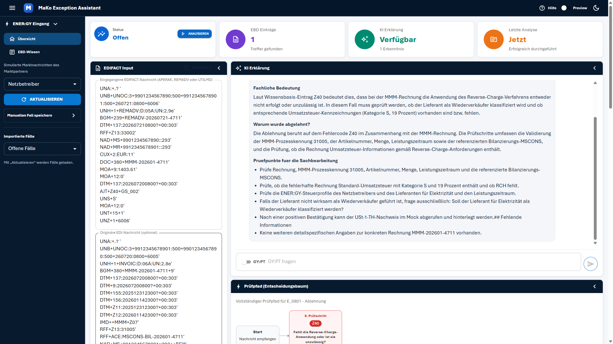 · 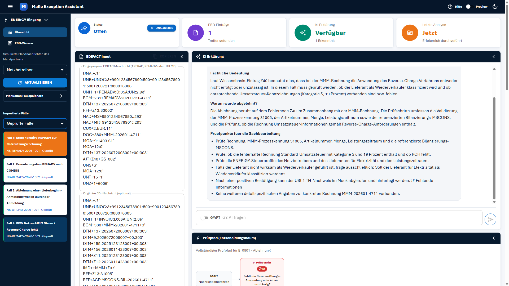

### Problem 2: Widersprüchliches Prüfergebnis („ja" vs. „nein") für denselben Fall
- **Schweregrad:** Kritisch
- **Schritt:** Schritt 4 / Schritt 6
- **Erwartet:** Eine konsistente Aussage, wie die Prüfung ausgegangen ist.
- **Tatsächlich:** Für denselben Prüfschritt 0 / Code Z40 stehen zwei gegensätzliche Werte auf einem Bildschirm:
  - „Gefundene EBD Einträge": **Prüfergebnis: ja**
  - Prüfpfad-Knoten: „Ergebnis: **nein**" und „Details zum aktuellen Fehlerpunkt": **Prüfergebnis: nein**

  Die Gegenprüfung in „EBD-Wissen" zeigt für Z40 ebenfalls **„Prüfergebnis: ja"** — die Abweichung entsteht also in der Prüfpfad-Darstellung.
- **Zusätzlich verwirrend:** Der Knoten stellt die Frage „Fehlt die Reverse-Charge-Anwendung oder ist sie unzulässig?" und antwortet „Ergebnis: nein" — mit rotem ×. Wenn nichts fehlt, warum ist es dann ein Fehler? Die Logik ist für eine Sachbearbeiterin nicht auflösbar.
- **Reaktion der Persona:** Vertrauensverlust. „Welcher Wert stimmt denn jetzt? Wenn sich das Tool schon bei ja/nein widerspricht, kann ich mich nicht darauf verlassen."
- **Screenshots:** 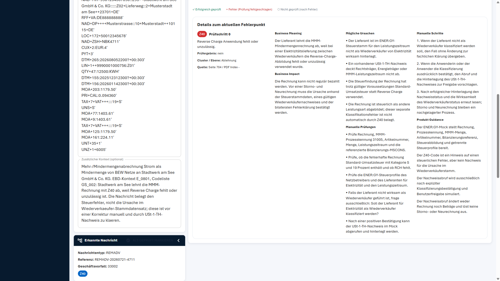 · 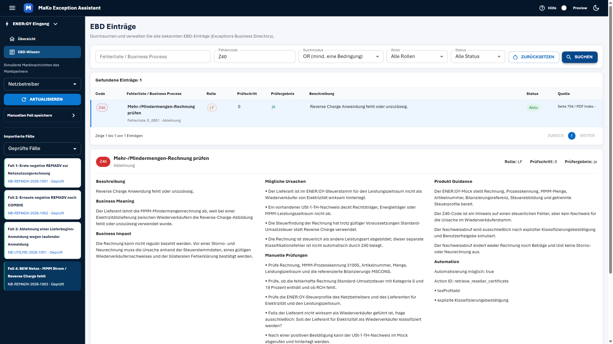

### Problem 3: „Fachliche Ansicht" ist keine fachliche Ansicht, sondern eine Rohsegment-Liste
- **Schweregrad:** Kritisch
- **Schritt:** Schritt 4
- **Erwartet:** Laut Journey „Fehlercode, betroffene Rolle, Prüfschritt und eine verständliche Kurzbeschreibung" — also eine Übersetzung der Nachricht in Alltagssprache.
- **Tatsächlich:** Die Sektion listet 18 EDIFACT-Segmentkürzel untereinander (`UNA:`, `UNB`, `UNH`, `BGM`, `DTM`, `RFF`, `NAD`, `NAD`, `CUX`, `DOC`, `MOA`, `MOA`, `DTM`, `AJT`, `UNS`, `MOA`, `UNT`, `UNZ`) — jeweils **zweimal dasselbe Kürzel** (blaues Badge + identischer Text daneben), ohne Klartextbezeichnung. Aufklappen zeigt lediglich die Rohzeile, z. B. `AJT+Z40+GS_002`. Kein einziges deutsches Wort in der gesamten Sektion.
- **Reaktion der Persona:** „Was soll ich damit? Ich kenne EDIFACT aus der Praxis, aber nicht die Syntax. Warum steht da nicht ‚Rechnungsnummer', ‚Absender', ‚Betrag'?" Sie überspringt die Sektion und verlässt sich ausschließlich auf die KI-Erklärung — womit die Gegenprüfmöglichkeit an der Nachricht selbst entfällt.
- **Screenshots:** 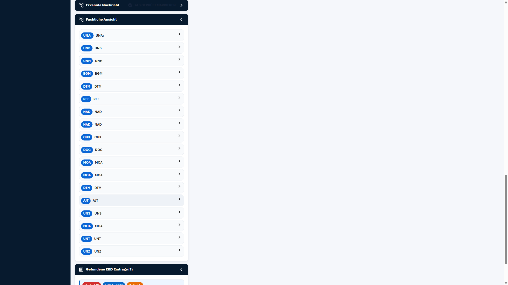 · 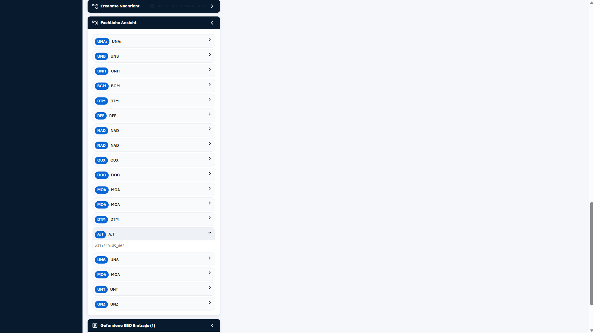

### Problem 4: „Manuelle Schritte" sind an das System adressiert, nicht an die Sachbearbeiterin
- **Schweregrad:** Mittel
- **Schritt:** Schritt 7
- **Erwartet:** Eine nummerierte Handlungsanleitung, nach der Nadine direkt arbeiten kann.
- **Tatsächlich:** Die drei Schritte sind aus Sicht des Assistenzsystems formuliert und nennen Nadine in der dritten Person:
  1. „Wenn der Lieferant nicht als Wiederverkäufer klassifiziert werden soll, den Fall ohne Änderung zur fachlichen Klärung übergeben."
  2. „Wenn **die Anwenderin oder der Anwender** die Klassifizierung ausdrücklich bestätigt, den Abruf und die Hinterlegung des USt-1-TH-Nachweises **zur Freigabe vorschlagen**."
  3. „Nach erfolgreicher Hinterlegung den Nachweisstatus … erneut lesen."

  Nadine *ist* die Anwenderin — Schritt 2 sagt also jemand anderem, was er ihr vorschlagen soll. Es fehlt durchgängig, **wo** sie etwas tut (welches System, welche Transaktion) und **an wen** sie übergibt.
- **Reaktion der Persona:** „Das klingt vernünftig, aber was mache *ich* jetzt konkret? Wo schaue ich den Steuerstamm nach — in SAP? Und an wen übergebe ich zur fachlichen Klärung?" Sie kann nicht unmittelbar handeln — das Kernziel der Journey wird nur teilweise erreicht.
- **Screenshot:** 

### Problem 5: Entwickler-Sprache im Ergebnistext („Mock", „Action ID", „taxProfileId")
- **Schweregrad:** Mittel
- **Schritt:** Schritt 5 / Schritt 7
- **Erwartet:** Fachsprache, die zu einem produktiven Prüfvorgang passt.
- **Tatsächlich:** Unter „Produkt Guidance" steht „Der ENER:GY-**Mock** stellt Rechnung, Prozesskennung … bereit" und „Der Nachweisabruf wird … **simuliert**". In der KI-Erklärung: „kann der USt-1-TH-Nachweis **im Mock** abgerufen und hinterlegt werden". In EBD-Wissen zusätzlich „Action ID: retrieve_reseller_certificate", „taxProfileId".
- **Reaktion der Persona:** „Mock? Simuliert? Ist das hier eine Attrappe oder mein echter Fall?" Genau der Punkt, an dem sie sich fragt, ob sie sich auf die Aussage verlassen darf, wenn ihr Name am Vorgang hängt.
- **Screenshot:** 

### Problem 6: Darstellungsfehler in der KI-Erklärung (Markdown und fehlende Umlaute)
- **Schweregrad:** Mittel
- **Schritt:** Schritt 5
- **Erwartet:** Sauber formatierter, korrekt geschriebener deutscher Text.
- **Tatsächlich:** Zwei Fehler im selben Block:
  - Rohes Markdown schlägt durch: „… kann der USt-1-TH-Nachweis im Mock abgerufen und hinterlegt werden.**## Fehlende Informationen**" — die Überschrift wird nicht gerendert und klebt am Ende eines Aufzählungspunkts.
  - Überschrift ohne Umlaute: „**Pruefpunkte fuer** die Sachbearbeitung" (im umgebenden Text werden Umlaute korrekt dargestellt). Ebenso im Kontextfeld: „Wiederverkaeufer-Stammdatensatz", „zu klaeren".
- **Reaktion der Persona:** „Das sieht aus, als wäre es nicht fertig." Untergräbt die Seriosität eines Textes, auf dessen Basis sie eine Rechnungsentscheidung treffen soll.
- **Screenshot:** 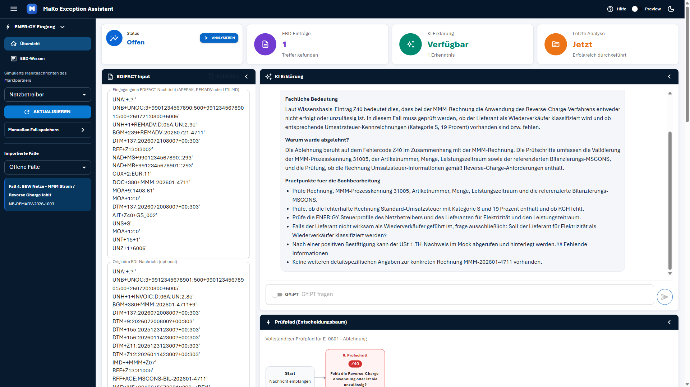

### Problem 7: Zwei unterschiedliche KI-Erklärungen an zwei Stellen — keine Quellenangabe an der prominenteren
- **Schweregrad:** Mittel
- **Schritt:** Schritt 5
- **Erwartet:** Eine Erklärung, mit sichtbarer Quelle (Seite/PDF-Index) direkt daneben.
- **Tatsächlich:** Es gibt zwei inhaltlich verschiedene Erklärungen:
  - Panel **„KI Erklärung"** (GY:PT-generiert): „Was ist passiert?" / „Fachliche Bedeutung" / „Warum wurde abgelehnt?" / „Pruefpunkte…" — **ohne jede Quellenangabe**, nur der Hinweis „Laut Wissensbasis-Eintrag Z40".
  - Block **„Details zum aktuellen Fehlerpunkt"** im Prüfpfad-Panel: „Business Meaning" / „Business Impact" / „Mögliche Ursachen" / „Manuelle Prüfungen" / „Manuelle Schritte" / „Produkt Guidance" — **mit** Quellenangabe.

  Die von der Journey erwarteten Inhalte (Business Meaning, Business Impact, Mögliche Ursachen, Manuelle Prüfungen, Manuelle Schritte) stehen also **nicht** im Abschnitt „KI Erklärung", sondern im Prüfpfad-Panel weiter unten.
- **Reaktion der Persona:** „Welche der beiden Erklärungen gilt denn jetzt? Und woher weiß die erste das?" Zusatzaufwand, weil sie beide lesen muss, um sicherzugehen.
- **Screenshot:** 

### Problem 8: Quellenangabe unvollständig — „PDF Index -"
- **Schweregrad:** Mittel
- **Schritt:** Schritt 5
- **Erwartet:** Vollständige Fundstelle, damit im EBD-Handbuch gegengeprüft werden kann.
- **Tatsächlich:** An allen drei Anzeigestellen steht „Quelle: **Seite 704 / PDF Index -**" — der PDF-Index fehlt. Zum Vergleich: Andere Einträge in „EBD-Wissen" liefern vollständige Angaben wie „Seite 81 / PDF Index 80". Die Lücke liegt also in den Daten zu Z40, nicht in der Anzeige. Ein leerer Wert wird zudem als Bindestrich ausgegeben, was wie ein Fehler aussieht.
- **Reaktion der Persona:** „Seite 704 finde ich schon — aber warum steht da ein Strich? Fehlt was?" Sie kann gegenprüfen, aber mit Restzweifel.
- **Screenshot:** 

### Problem 9: Button „Als geprüft markieren" überlagert den Sektionskopf „Erkannte Nachricht"
- **Schweregrad:** Mittel
- **Schritt:** Schritt 4 / Schritt 8
- **Erwartet:** Ein Abschluss-Button, der klar als solcher erkennbar und nicht im Weg ist.
- **Tatsächlich:** Der Button sitzt mitten im dunklen Kopfbereich der Sektion „Erkannte Nachricht" und **blockiert deren Klickfläche**: Der Versuch, die Sektion über den Kopf aufzuklappen, schlug reproduzierbar fehl (Playwright: „subtree intercepts pointer events"); erst ein Klick auf den Text ganz links funktionierte. Optisch wirkt der Button durch graue Schrift auf dunklem Grund durchgehend **deaktiviert** — auch dann, wenn er aktiv ist.
- **Reaktion der Persona:** „Warum geht die Sektion nicht auf?" und später „Der Knopf sieht ausgegraut aus, kann ich den überhaupt drücken?" Der wichtigste Abschluss-Button der Anwendung ist der am schlechtesten erkennbare.
- **Screenshot:** 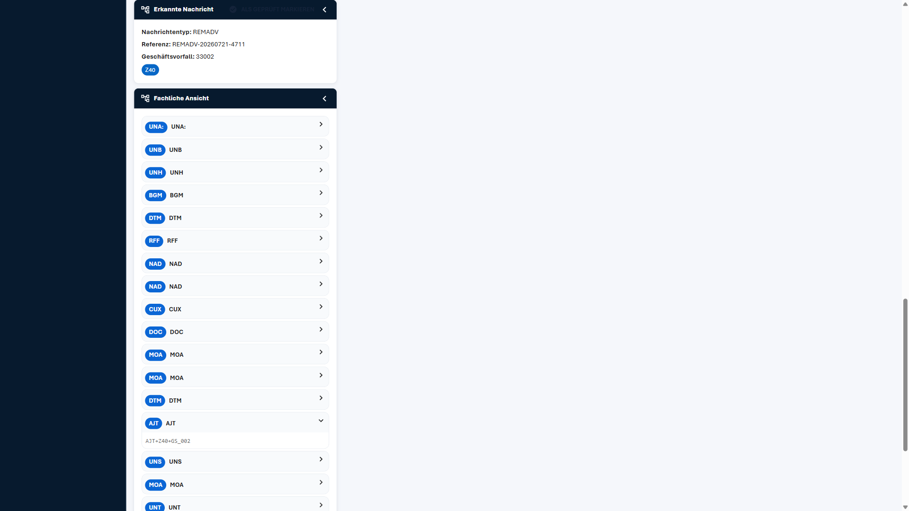

### Problem 10: Vorbelegtes EDIFACT-Feld ohne zugehörigen Fall beim Start
- **Schweregrad:** Gering
- **Schritt:** Schritt 1
- **Erwartet:** Ein leerer Analysebereich, bis ein Fall gewählt ist (so beschreibt es auch die Journey).
- **Tatsächlich:** Direkt nach dem Laden steht im Feld „Eingegangene EDIFACT-Nachricht" bereits eine Beispielnachricht (`UNH+1+APERAK:D:96A:UN'BGM+ZZZ+4711'ERC+A01:…`), die zu **keinem** der vier Fälle gehört. Kein Fall ist ausgewählt, Status „Bereit".
- **Reaktion der Persona:** „Ist das schon ein Fall? Von wem?" Kurze Irritation; im schlechteren Fall analysiert sie versehentlich die Beispielnachricht statt ihres Falls.
- **Screenshot:** 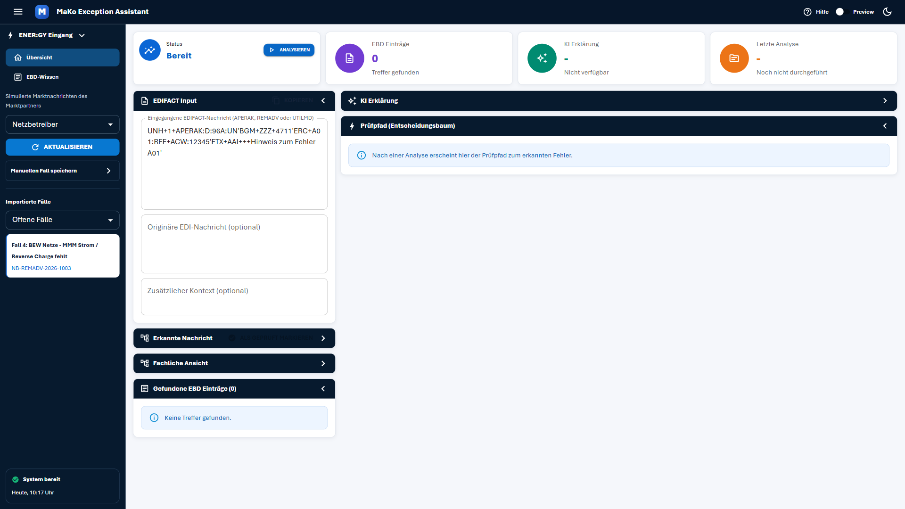

### Problem 11: Kein Absprung vom Analyseergebnis in die EBD-Wissen-Suche
- **Schweregrad:** Gering
- **Schritt:** Schritt 5
- **Erwartet:** Ein Klick vom gefundenen Code Z40 zum Wissensbasis-Eintrag.
- **Tatsächlich:** Weder der Badge „Code Z40" noch die Quellenangabe sind verlinkt. Zum Gegenprüfen muss Nadine links auf „EBD-Wissen" wechseln und „Z40" von Hand eintippen. Die Suche selbst funktioniert dann gut (1 Treffer, vollständiger Eintrag).
- **Reaktion der Persona:** Widerspricht ihrem Pain Point „zu viele Klicks zwischen Posteingang und nächstem Schritt" — funktioniert, ist aber Handarbeit.
- **Screenshot:** 

### Problem 12: Unerklärte Abkürzungen und Bezeichner
- **Schweregrad:** Gering
- **Schritt:** Schritt 1 / Schritt 4
- **Erwartet:** Tooltips oder ausgeschriebene Begriffe für Gelegenheitsnutzer.
- **Tatsächlich:** Ohne jede Erläuterung: „ENER:GY Eingang" (Sidebar-Titel), „GY:PT" (Chat-Funktion), „Rolle LF", „EBD E_0801", „Cluster: Ablehnung", „Codeliste GS_002", „Prüfschritt 0". Kein Tooltip, kein Glossar. „Hilfe" oben rechts ist reiner Text ohne Klickfunktion.
- **Reaktion der Persona:** „LF ist Lieferant, das weiß ich. Aber was ist ein Cluster? Und was heißt GY:PT?" Erschließbar, aber genau der von der Persona benannte Pain Point.
- **Screenshot:** 

### Problem 13: Ladeanzeige zu dezent für unterbrochenes Arbeiten
- **Schweregrad:** Gering
- **Schritt:** Schritt 3
- **Erwartet:** Deutlich sichtbare Rückmeldung, dass die Analyse läuft.
- **Tatsächlich:** Während der Analyse (~15 s) wechselt lediglich die Status-Kachel auf „Prüft" und im Button erscheint ein kleiner Spinner. Die drei Ergebnis-Kacheln bleiben auf „0", „-", „-" stehen, der restliche Bildschirm verändert sich nicht.
- **Reaktion der Persona:** Sie wird laut Persona ständig unterbrochen (Telefon, E-Mail). Nach dem Zurückkommen ist nicht auf einen Blick klar, ob noch gerechnet wird oder ob das Ergebnis schon da ist — zumal der Status danach wieder auf „Offen" springt (siehe Problem 1).
- **Screenshot:** 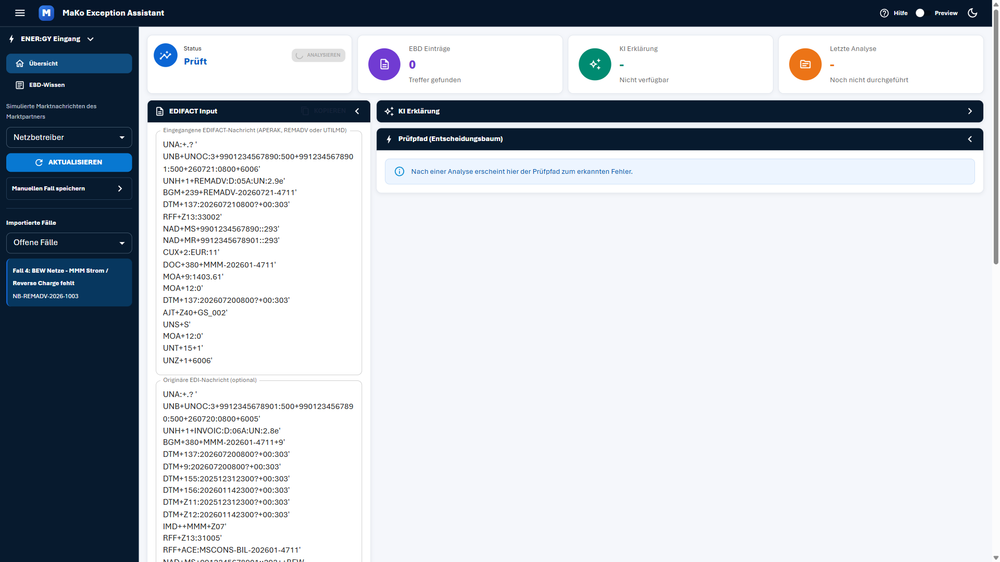

### Problem 14: Fehlermeldung erscheint weit entfernt vom auslösenden Button
- **Schweregrad:** Gering
- **Schritt:** Edge Case „leeres EDIFACT-Feld"
- **Erwartet:** Rückmeldung in der Nähe der Aktion.
- **Tatsächlich:** Der (inhaltlich sehr gute) Toast „Bitte zuerst eine EDIFACT-Nachricht einfügen." erscheint **unten links**, während der Button „Analysieren" **oben rechts** liegt — bei 1920 × 1080 die maximale Bildschirmdiagonale.
- **Reaktion der Persona:** Blickt auf den Button, sieht dort nichts passieren; entdeckt die Meldung erst verzögert.
- **Screenshot:** 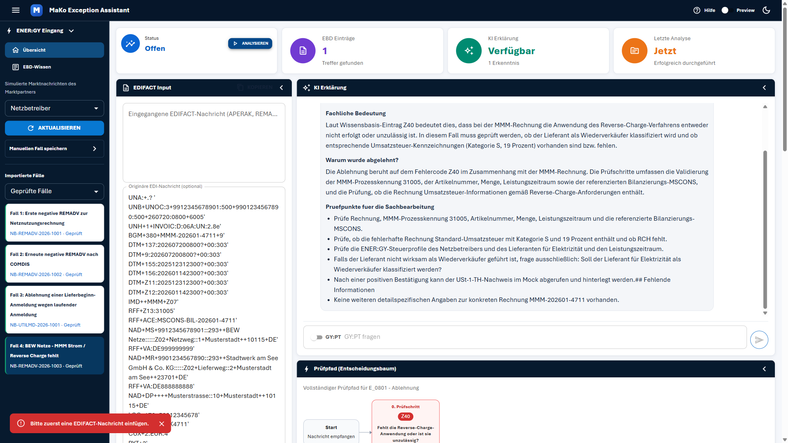

### Problem 15: Hover- und Auswahl-Zustand in der Fallliste nicht unterscheidbar
- **Schweregrad:** Gering
- **Schritt:** Schritt 2
- **Erwartet:** Der ausgewählte Fall hebt sich eindeutig ab.
- **Tatsächlich:** Ein Fall unter dem Mauszeiger und der tatsächlich ausgewählte Fall werden identisch orange dargestellt. Verifiziert: Nach Wegbewegen des Zeigers blieb nur der ausgewählte Fall orange.
- **Reaktion der Persona:** Geringe Auswirkung, kann aber bei mehreren Fällen zur Fehlauswahl führen.
- **Screenshot:** 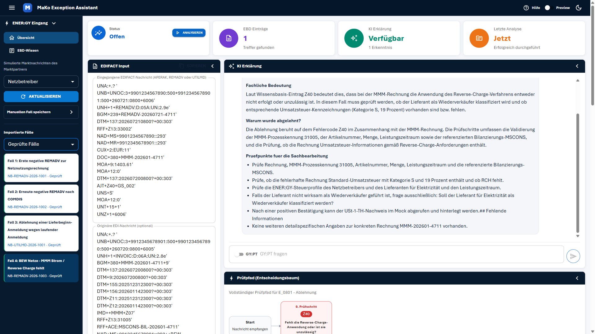

---

## Durchgeführte Schritte

| Schritt | Beschreibung | Status | Anmerkung |
|---------|-------------|--------|-----------|
| 1 | Übersicht aufrufen (http://localhost:5173) | ⚠️ | Seite lädt schnell, Zweck erkennbar. Aber: EDIFACT-Feld bereits mit fremder Beispielnachricht vorbelegt (Problem 10); nur 1 offener Fall statt des erwarteten Fall 1. Einzige Konsolenmeldung: 404 auf `favicon.ico` (nicht nutzersichtbar). |
| 2 | Offenen Fall auswählen (Fall 4 statt Fall 1) | ✅ | REMADV + originäre INVOIC + Kontext werden geladen, Status → „Offen", Fall orange hervorgehoben. Klare Bestätigung. |
| 3 | Fall analysieren | ⚠️ | Analyse läuft ca. 15 s durch, Status „Prüft" mit Spinner. Ergebnis vollständig. Aber: Status springt danach zurück auf **„Offen"** statt auf einen Ergebnis-Status; Ladeanzeige sehr dezent (Problem 13). |
| 4 | EBD-Treffer & Fachliche Ansicht prüfen | ❌ | „Gefundene EBD Einträge" liefert alles Nötige (Code Z40, EBD E_0801, Rolle LF, Prüfschritt, Cluster, Quelle). Die **„Fachliche Ansicht" ist unbrauchbar** (Problem 3); „Erkannte Nachricht" ließ sich über den Kopf nicht öffnen (Problem 9); Prüfergebnis widersprüchlich (Problem 2). |
| 5 | KI-Erklärung lesen | ⚠️ | Inhaltlich verständlich und in Alltagssprache. Aber: zwei konkurrierende Erklärungen (Problem 7), keine Quelle am prominenteren Panel, Markdown- und Umlautfehler (Problem 6), „Mock"-Sprache (Problem 5). |
| 6 | Prüfpfad nachvollziehen | ✅ | **Bestes Element des Tests.** Nur Start → Prüfschritt 0 mit rotem ×, Fehlerpunkt sofort erfassbar, kein Scrollen durch 27 Schritte nötig. Legende ✓/×/○ ist ausgeschrieben und selbsterklärend. Einschränkung: Die Legende erklärt ✓ und ○, die im Baum gar nicht vorkommen; „Ergebnis: nein" widerspricht dem EBD-Treffer (Problem 2). |
| 7 | Manuelle Schritte bewerten | ⚠️ | Nummerierte Liste vorhanden, inhaltlich fachlich plausibel — aber aus Systemsicht formuliert und ohne Angabe von Zielsystem/Ansprechpartner (Problem 4). |
| 8 | Fall als geprüft markieren | ❌ | Funktion greift technisch (Fall erscheint unter „Geprüfte Fälle" mit „· Geprüft"), aber **ohne jede Rückmeldung** und mit weiterhin falscher Status-Anzeige „Offen" (Problem 1). |

### Getestete Edge Cases

| Edge Case | Ergebnis | Anmerkung |
|-----------|----------|-----------|
| „Analysieren" mit leerem EDIFACT-Feld | ✅ | Klare deutsche Fehlermeldung „Bitte zuerst eine EDIFACT-Nachricht einfügen.", keine Analyse gestartet. Nur die Position ist ungünstig (Problem 14). |
| Gegenprüfung der Quelle über „EBD-Wissen" | ✅ | Suche nach Fehlercode „Z40" liefert genau 1 Treffer mit identischen Inhalten (1300 Einträge insgesamt, Filter für Rolle/Status/Suchmodus vorhanden). Bestätigt zugleich Problem 2 und Problem 8. |
| Fall ohne EBD-Treffer (0 Treffer) | ➖ | Nicht getestet — die vorbelegte Beispielnachricht (APERAK/A01) hätte den Fallzustand überschrieben; kein gezielter Testfall vorhanden. |
| Eigene EDIFACT-Nachricht manuell einfügen | ➖ | Nicht getestet. |
| Anderen Fall während laufender Analyse anklicken | ➖ | Nicht getestet — nur ein offener Fall verfügbar. |

---

## Erfolgskriterien

| Kriterium | Erfüllt? | Anmerkung |
|-----------|----------|-----------|
| Nadine gelangt ohne Einführung von der Fallliste zu einem vollständigen Analyseergebnis | ✅ | In 3 Klicks und unter 1 Minute (inkl. Analysedauer). |
| Sie könnte die Ablehnungsursache in eigenen Worten wiedergeben | ✅ | „Die Rechnung wurde abgelehnt, weil bei der Mindermengenrechnung zwischen Wiederverkäufern das Reverse-Charge-Verfahren fehlt oder falsch angewendet wurde." — geht direkt aus „Business Meaning" hervor. |
| Sie könnte mindestens einen konkreten nächsten Schritt benennen | ⚠️ | Aus „Manuelle Prüfungen" ja („Steuerprofile von Netzbetreiber und Lieferant für Elektrizität und Leistungszeitraum prüfen"). Aus „Manuelle Schritte" nur eingeschränkt — sie sind an das System adressiert (Problem 4). |
| Der Abschluss ist eindeutig und ohne Zweifel erkennbar | ❌ | Klar verfehlt: keine Bestätigung, Status bleibt „Offen", Fall verschwindet kommentarlos (Problem 1). |
| Keine kritischen Fehler oder unverständlichen Fehlermeldungen | ⚠️ | Keine Abstürze, keine kryptischen Fehlermeldungen, nur ein harmloser 404 auf `favicon.ico` in der Konsole. Aber: widersprüchliche Fachdaten (Problem 2) und Darstellungsfehler (Problem 6) sind inhaltlich kritisch. |

**Journey-Bewertung:** 2 von 5 Erfolgskriterien voll erfüllt, 2 eingeschränkt, 1 verfehlt.

---

## Empfehlungen

**Sofort (blockiert Nadines Kernaufgabe):**
1. **Abschluss-Feedback ergänzen:** Beim Klick auf „Als geprüft markieren" einen Toast („Fall NB-REMADV-2026-1003 wurde als geprüft markiert") anzeigen und die Status-Kachel auf „Geprüft" umstellen. Der Toast-Mechanismus existiert bereits — er wird an dieser Stelle nur nicht genutzt.
2. **Status-Kachel korrekt führen:** Nach der Analyse und nach dem Abschluss darf dort nicht weiterhin „Offen" stehen. Ergebnis-Status einführen (z. B. „Analysiert" / „Geprüft").
3. **Prüfergebnis-Widerspruch auflösen:** Der Wert im Prüfpfad-Knoten („nein") muss mit dem EBD-Stammdatensatz („ja") übereinstimmen. Solange beides nebeneinander steht, verliert die gesamte Analyse an Glaubwürdigkeit.

**Kurzfristig:**
4. **„Fachliche Ansicht" tatsächlich fachlich machen:** Segmentkürzel in Klartext übersetzen (`BGM` → „Nachrichtenkopf / Rechnungsnummer", `MOA+9` → „Rechnungsbetrag 1.403,61 EUR", `AJT+Z40` → „Ablehnungsgrund Z40"). Ohne Übersetzung ist die Sektion für die Zielgruppe wertlos und sollte lieber „Nachrichtenstruktur (technisch)" heißen.
5. **„Manuelle Schritte" adressatengerecht umformulieren:** Direkte Anrede, Zielsystem und Ansprechpartner nennen — z. B. „1. Prüfen Sie in SAP IS-U das Steuerprofil des Lieferanten für Elektrizität im Leistungszeitraum …", „3. Falls keine Wiederverkäufer-Klassifizierung vorliegt: Fall an die Steuerfachabteilung übergeben."
6. **Entwickler-Sprache entfernen:** „Mock", „simuliert", „Action ID", „taxProfileId" aus allen nutzersichtbaren Texten streichen oder in einen technischen Bereich verschieben.
7. **Darstellungsfehler beheben:** Markdown im KI-Text korrekt rendern (`## Fehlende Informationen` als Überschrift) und Umlaute in „Pruefpunkte fuer die Sachbearbeitung" korrigieren.
8. **Abschluss-Button aus dem Sektionskopf lösen:** Als eigenständigen, kontrastreichen Button platzieren (z. B. neben „Analysieren" in der Status-Kachel), damit er die Klickfläche von „Erkannte Nachricht" nicht blockiert und nicht deaktiviert aussieht.

**Mittelfristig:**
9. **Die beiden KI-Erklärungen zusammenführen** oder klar benennen (z. B. „KI-Zusammenfassung" vs. „EBD-Stammdaten") und die Quellenangabe auch am oberen Panel anzeigen.
10. **PDF-Index für Z40 nachpflegen** und leere Werte nicht als „-" ausgeben, sondern die Zeile weglassen.
11. **Code-Badge Z40 verlinken**, sodass ein Klick direkt den passenden EBD-Wissen-Eintrag öffnet — spart Nadine den Modulwechsel und das Abtippen.
12. **Tooltips für Fachbegriffe** ergänzen: „Cluster", „Prüfschritt", „Rolle LF", „EBD", „GY:PT", „ENER:GY". Die vorhandene „Hilfe" oben rechts ist derzeit ohne Funktion.
13. **Beispielnachricht beim Start entfernen** oder deutlich als „Beispiel" kennzeichnen.
14. **Toast-Position** näher an den auslösenden Bereich rücken (oben rechts statt unten links).

---

## Hinweis zur Testumgebung
Nach diesem Lauf sind **alle vier Fälle** als „Geprüft" markiert. Für weitere Testläufe müssen die Fallstatus zurückgesetzt werden, sonst steht kein offener Fall mehr zur Verfügung.
