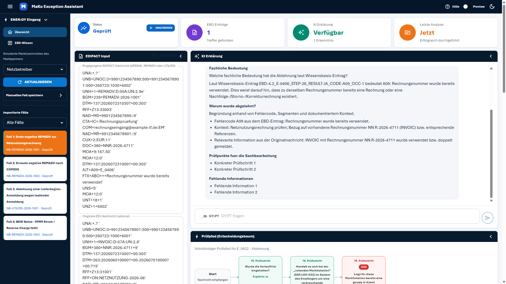
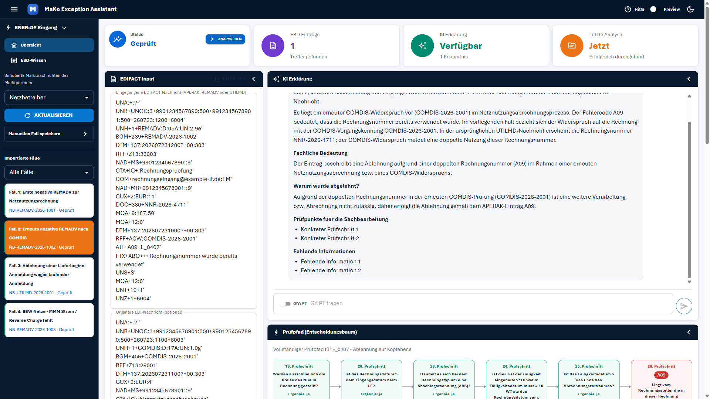
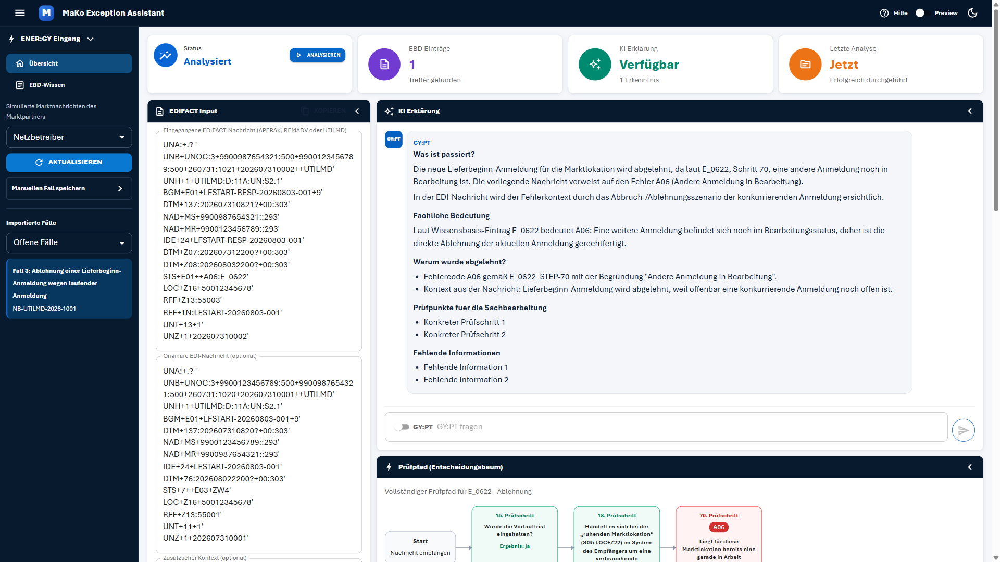
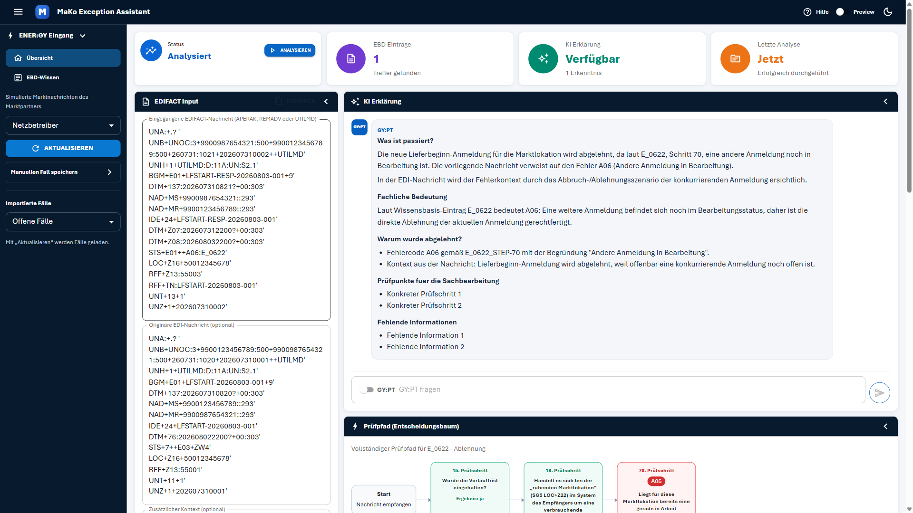
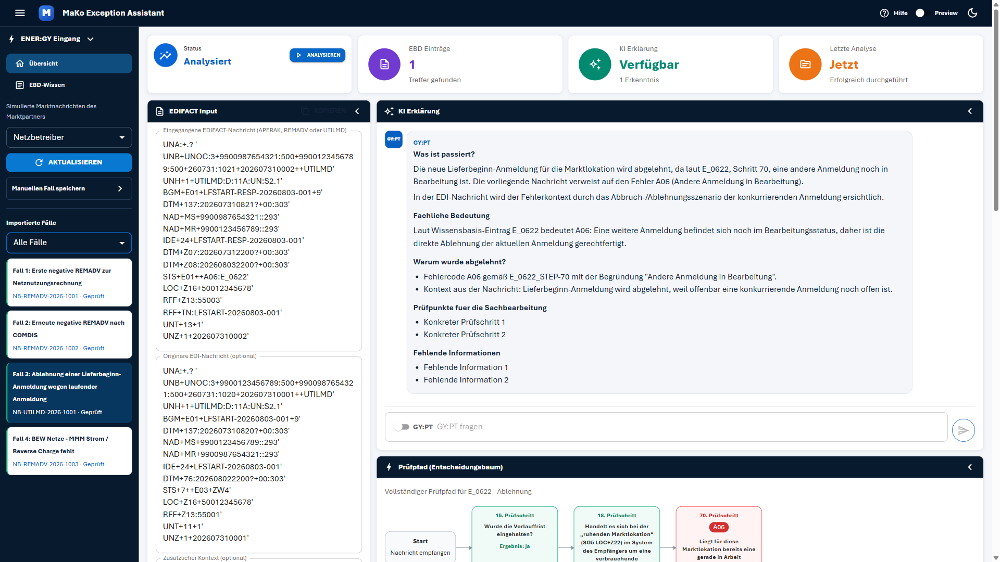
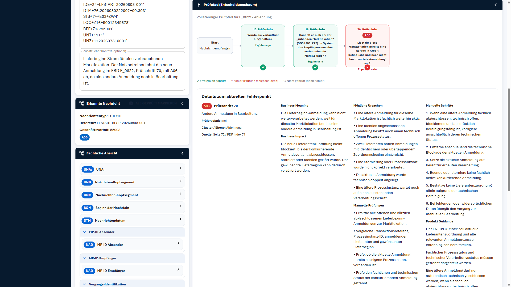
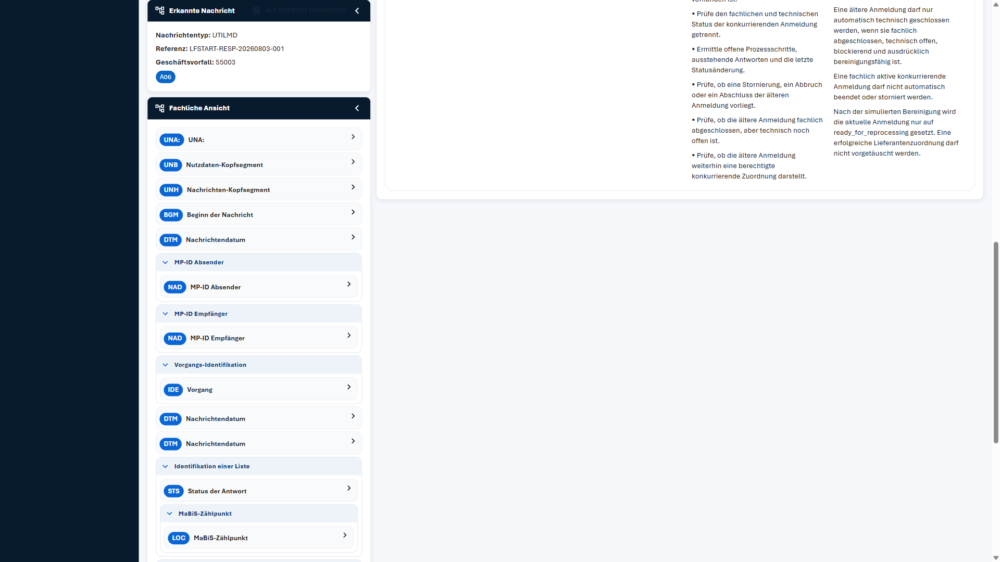
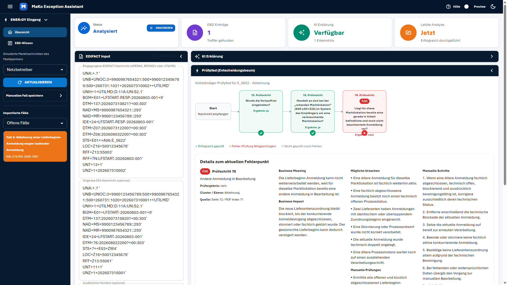
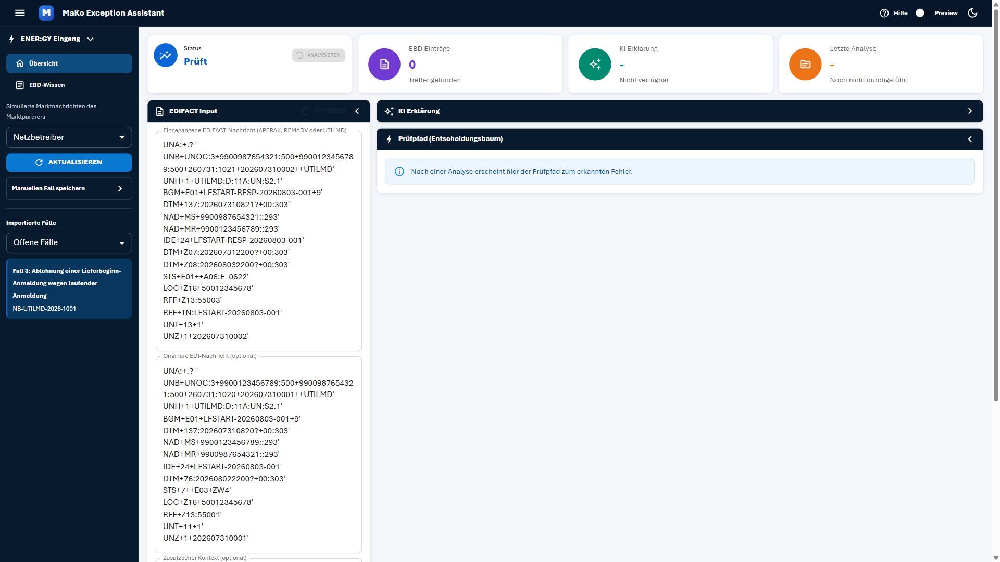
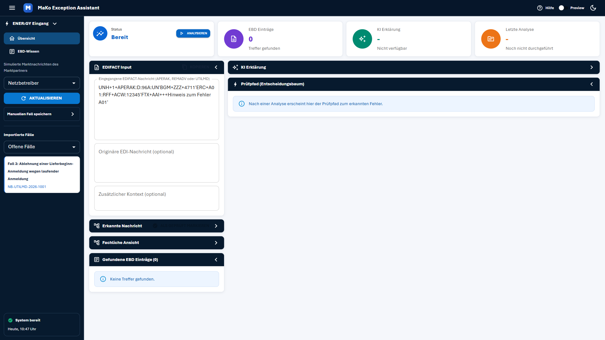

# Testreport: Nadine Krüger — 2026-08-28 (Fall 3)

## Zusammenfassung
- **Getestete Journey:** Exception-Fall analysieren und abschließen (`nadine-krueger-journey.md`), Schritt 2 abweichend mit **Fall 3** statt Fall 1
- **URL:** http://localhost:5173
- **Datum:** 2026-08-28
- **Persona:** Nadine Krüger, 38, Sachbearbeiterin Marktkommunikation / Rechnungsprüfung (`nadine-krueger-persona.md`)
- **Testfall:** Fall 3: Ablehnung einer Lieferbeginn-Anmeldung wegen laufender Anmeldung (NB-UTILMD-2026-1001, UTILMD, Fehlercode A06, EBD E_0622)
- **Ergebnis:** ⚠️ Mit Problemen
- **Dauer:** 5m 33s (10:47:39 – 10:53:12 Uhr)
- **Playwright-Aktionen:** 34 (davon 1 fehlgeschlagen — siehe Problem 5)
- **Viewport:** 1920 × 1080 (laut Persona)

### Ausgangslage
Fall 3 war zu Testbeginn wieder als **offener** Fall verfügbar und der einzige offene Fall in der Liste. Die Auswahl gemäß Anforderung war damit direkt möglich.

### Vergleich zum vorherigen Lauf
Dieser Lauf deckt teils **andere** Befunde auf als der Lauf mit Fall 4 (REMADV) — mehrere dort vermutete Grundsatzprobleme erweisen sich als fall- bzw. nachrichtentyp-spezifisch. Die Abweichungen sind unter „Korrekturen und Präzisierungen" am Ende zusammengefasst.

---

## Gesamteindruck aus Sicht der Persona

Dieser Fall hat sich für mich deutlich besser angefühlt als der letzte. Der Prüfpfad zeigt mir diesmal wirklich einen *Weg*: Vorlauffrist geprüft ✓, Marktlokation geprüft ✓, und dann scheitert es an Schritt 70 ✗ — das kann ich einem Kollegen erklären, ohne ins Handbuch zu schauen. Und die „Fachliche Ansicht" war endlich das, was der Name verspricht: „MP-ID Absender", „MaBiS-Zählpunkt", „Status der Antwort". Da weiß ich, was ich vor mir habe. Auch die Quellenangabe war diesmal vollständig — Seite 72, PDF-Index 71 — damit kann ich gegenprüfen.

Was mich richtig geärgert hat: Genau an der Stelle, an der stehen soll, was *ich* konkret prüfen muss, stand „Konkreter Prüfschritt 1" und „Konkreter Prüfschritt 2". Und darunter „Fehlende Information 1", „Fehlende Information 2". Das ist kein Text, das sind Lückenfüller. Wenn ich mich auf so eine Erklärung stützen soll, während mein Name am Vorgang hängt, ist das schlicht unbrauchbar.

Und dann das, was mir am meisten Sorge macht: Ich habe eine Analyse gestartet und zwischendurch — weil das Telefon ging und ich schnell was nachschauen wollte — auf einen anderen Fall geklickt. Danach stand oben Fall 1 und unten immer noch der Prüfpfad von Fall 3. **Zwei verschiedene Fälle auf einem Bildschirm, ohne jede Warnung.** Genau so passieren mir Fehler, für die ich am Ende geradestehe. Ich unterbreche ständig — das wird mir garantiert wieder passieren.

Beim Abschluss dann wieder dasselbe wie zuletzt: geklickt, Fall weg, keine Bestätigung, oben steht weiter „Analysiert".

**Würde ich das Tool wieder nutzen?** Für die Analyse ja — der Prüfpfad ist wirklich gut. Aber ich würde nach jedem Fallwechsel misstrauisch prüfen, ob unten noch der richtige Fall steht.

---

## Gefundene Probleme

### Problem 1: Fallwechsel während laufender Analyse führt zu vermischten Falldaten
- **Schweregrad:** Kritisch
- **Schritt:** Edge Case (Journey: „Was passiert, wenn während einer laufenden Analyse ein anderer Fall angeklickt wird?")
- **Erwartet:** Entweder wird der Wechsel blockiert, die laufende Analyse abgebrochen, oder alle Bereiche wechseln gemeinsam auf den neuen Fall.
- **Tatsächlich:** Nach Klick auf „Analysieren" (Fall 3) und sofortigem Klick auf Fall 1 entsteht ein **dauerhafter Mischzustand**:
  - EDIFACT Input: **Fall 1** (`REMADV-2026-1001`, `AJT+A09+E_0406`)
  - KI Erklärung: **Fall 1** (Code A09, „Rechnungsnummer wurde bereits verwendet")
  - Prüfpfad (Entscheidungsbaum): **weiterhin Fall 3** („Vollständiger Prüfpfad für **E_0622**", Prüfschritte 15/18/70, Code **A06**, „ruhende Marktlokation")

  Auch nach 20 Sekunden Wartezeit löste sich der Zustand **nicht** auf. Es gab keine Fehlermeldung, keinen Hinweis, keinen Ladezustand.
- **Eingegrenzt:** Ein Fallwechsel **ohne** laufende Analyse (Fall 1 → Fall 2) aktualisiert den Prüfpfad korrekt und vollständig (E_0407, Prüfschritte 19–26). Der Fehler tritt also spezifisch beim Wechsel **während** einer laufenden Analyse auf.
- **Reaktion der Persona:** Der gefährlichste Befund für diese Persona. Sie arbeitet laut Persona-Beschreibung „mehrere Fälle hintereinander zwischen anderen Aufgaben (Telefon, E-Mail) – wird häufig unterbrochen". Sie würde die Erklärung zu Fall 1 lesen und den Prüfpfad von Fall 3 als zugehörig ansehen — und daraus eine falsche fachliche Entscheidung ableiten, ohne dass ihr etwas auffällt.
- **Screenshots:**  ·  · 

### Problem 2: Platzhaltertext statt Inhalt in der KI-Erklärung
- **Schweregrad:** Kritisch
- **Schritt:** Schritt 5
- **Erwartet:** Konkrete, fallbezogene Prüfpunkte, die Nadine abarbeiten kann.
- **Tatsächlich:** Im Panel „KI Erklärung" stehen unter zwei Überschriften ausschließlich unausgefüllte Template-Platzhalter:
  - „Prüfpunkte fuer die Sachbearbeitung": **„Konkreter Prüfschritt 1"**, **„Konkreter Prüfschritt 2"**
  - „Fehlende Informationen": **„Fehlende Information 1"**, **„Fehlende Information 2"**
- **Verbreitung:** Reproduziert bei **Fall 3, Fall 1 und Fall 2**. Bei Fall 4 (vorheriger Lauf) waren diese Abschnitte mit echten Inhalten gefüllt. Der Defekt betrifft also die Mehrzahl der Fälle, ist aber nicht durchgängig.
- **Reaktion der Persona:** „Das ist der Abschnitt, der mir sagen soll, was ich prüfen muss — und da steht Platzhalter drin." Genau ihr Ziel („am Ende jedes Falls konkrete, umsetzbare nächste Schritte haben") wird an dieser Stelle verfehlt. Rettung: Der Block „Manuelle Prüfungen" im Prüfpfad-Panel enthält die echten Inhalte — aber sie muss ihn erst finden.
- **Screenshot:** 

### Problem 3: Kein Feedback beim Abschluss — Status bleibt stehen (reproduziert)
- **Schweregrad:** Kritisch
- **Schritt:** Schritt 8
- **Erwartet:** Eindeutige Bestätigung; die Status-Kachel wechselt auf „Geprüft".
- **Tatsächlich:** Wie im vorherigen Lauf: **kein Toast, keine Bestätigung**. Der Fall verschwand aus „Offene Fälle" (Liste leer mit „Mit ‚Aktualisieren' werden Fälle geladen."). Die Status-Kachel blieb auf **„Analysiert"** stehen. Erst der Filterwechsel zeigte Fall 3 unter „Geprüfte Fälle" mit „· Geprüft".
- **Präzisierung gegenüber dem letzten Lauf:** Der Status **„Geprüft" existiert und wird korrekt angezeigt** — er erschien, als anschließend der bereits geprüfte Fall 1 geladen wurde. Die Kachel spiegelt also den Fall-Status, wird aber **nach dem Klick auf „Als geprüft markieren" nicht aktualisiert**. Es ist damit kein fehlender Status, sondern eine fehlende Aktualisierung.
- **Reaktion der Persona:** „Ich habe geklickt, der Fall ist weg, und oben steht noch ‚Analysiert'. Ist er jetzt zu?" Unverändert der stärkste Vertrauensbruch im gesamten Ablauf.
- **Screenshots:**  · 

### Problem 4: Widersprüchliches Prüfergebnis („ja" vs. „nein") — reproduziert
- **Schweregrad:** Kritisch
- **Schritt:** Schritt 4 / Schritt 6
- **Erwartet:** Eine konsistente Aussage.
- **Tatsächlich:** Für denselben Prüfschritt 70 / Code A06:
  - „Gefundene EBD Einträge": „Prüfschritt: 70 · **Prüfergebnis: ja**"
  - Prüfpfad-Knoten: „**Ergebnis: nein**"; „Details zum aktuellen Fehlerpunkt": „**Prüfergebnis: nein**"
- **Bedeutung:** Da dieser Widerspruch bei Fall 4 (REMADV/Z40) **und** Fall 3 (UTILMD/A06) identisch auftritt, ist er **systematisch** und nicht fallspezifisch.
- **Zusätzlich verwirrend:** Der Knoten fragt „Liegt für diese Marktlokation bereits eine gerade in Arbeit befindliche und noch nicht beantwortete Anmeldung vor?" und antwortet „Ergebnis: **nein**" — mit rotem ×. Fachlich ist genau das Gegenteil der Fall: Es *liegt* eine andere Anmeldung vor, das ist der Ablehnungsgrund. Die angezeigte Antwort widerspricht dem eigenen Fehlertext „Andere Anmeldung in Bearbeitung".
- **Reaktion der Persona:** „Da steht ‚nein', aber der Fehler sagt doch genau, dass eine andere Anmeldung läuft. Was stimmt denn nun?" Sie kann den Prüfpfad nicht mehr als Beleg verwenden.
- **Screenshot:** 

### Problem 5: Button „Als geprüft markieren" blockiert den Sektionskopf — reproduziert
- **Schweregrad:** Mittel
- **Schritt:** Schritt 4
- **Erwartet:** Die Sektion „Erkannte Nachricht" lässt sich über ihre Kopfzeile aufklappen.
- **Tatsächlich:** Identisch zum vorherigen Lauf: Der Klick auf den Kopf schlug reproduzierbar fehl (Playwright: „subtree intercepts pointer events"), weil der Button darüberliegt. Nur ein Klick auf den Text ganz links funktionierte. Der Button wirkt durch graue Schrift auf dunklem Grund weiterhin deaktiviert, obwohl er aktiv ist.
- **Reaktion der Persona:** „Warum geht das nicht auf?" — und beim Abschluss die Unsicherheit, ob der Button überhaupt klickbar ist.
- **Screenshot:** 

### Problem 6: Fehler-Symbol überdeckt den Ergebnistext im Prüfpfad
- **Schweregrad:** Mittel
- **Schritt:** Schritt 6
- **Erwartet:** Symbol und Text sind beide vollständig lesbar.
- **Tatsächlich:** Im roten Fehlerknoten (70. Prüfschritt) liegt das rote ×-Badge **auf** der Zeile „Ergebnis: nein" — lesbar bleibt nur „Ergeb…: nein" mit dem Symbol mittendrin. Bei den grünen ✓-Knoten sitzt das Badge sauber unterhalb des Kastens; nur beim Fehlerknoten überlappt es.
- **Reaktion der Persona:** Ausgerechnet die Information am wichtigsten Knoten — dem einzigen mit Fehler — ist teilweise verdeckt.
- **Screenshot:** 

### Problem 7: „Vollständiger Prüfpfad" ist nicht vollständig
- **Schweregrad:** Mittel
- **Schritt:** Schritt 6
- **Erwartet:** Entweder alle Prüfschritte, oder eine ehrliche Beschriftung.
- **Tatsächlich:** Die Überschrift lautet „**Vollständiger** Prüfpfad für E_0622 - Ablehnung", angezeigt werden aber nur die Schritte **15, 18 und 70**. Die Sprünge (1–14, 16–17, 19–69) bleiben unerklärt. Die Legende führt zudem „○ Nicht geprüft (nach Fehler)" auf — dieses Symbol kommt im Baum überhaupt nicht vor.
- **Bewertung:** Für Nadines Arbeitsweise ist die Verkürzung **richtig** (sie muss nicht 27+ Schritte lesen) — nur die Beschriftung führt in die Irre. Besser: „Durchlaufener Prüfpfad" oder „Relevante Prüfschritte".
- **Reaktion der Persona:** „Wenn das vollständig ist — wo sind Schritte 16 und 17? Habe ich was übersehen?"
- **Screenshot:** 

### Problem 8: „Letzte Analyse: Jetzt" auch ohne durchgeführte Analyse
- **Schweregrad:** Mittel
- **Schritt:** Schritt 2
- **Erwartet:** Eine ehrliche Zeitangabe, wann das angezeigte Ergebnis entstanden ist.
- **Tatsächlich:** Bereits beim bloßen **Auswählen** von Fall 3 — vor jedem Klick auf „Analysieren" — waren alle Ergebnisse befüllt (Status „Analysiert", 1 EBD-Treffer, kompletter Prüfpfad) und die Kachel meldete „Letzte Analyse: **Jetzt** — Erfolgreich durchgeführt". Das Ergebnis stammte aus einem früheren Lauf. Derselbe Effekt trat beim Laden von Fall 1 und Fall 2 auf.
- **Reaktion der Persona:** „Jetzt" suggeriert ein taggenaues, frisches Ergebnis. Nadine müsste erkennen können, ob sie ein gespeichertes Ergebnis von gestern oder eine frische Analyse vor sich hat — gerade weil sich Stammdaten zwischenzeitlich ändern können.
- **Screenshot:** 

### Problem 9: Analyse verwirft sichtbar alle vorhandenen Ergebnisse
- **Schweregrad:** Gering
- **Schritt:** Schritt 3
- **Erwartet:** Das bisherige Ergebnis bleibt sichtbar, bis das neue vorliegt.
- **Tatsächlich:** Mit Klick auf „Analysieren" werden alle Anzeigen sofort geleert — EBD Einträge zurück auf „0", KI Erklärung „-", Letzte Analyse „Noch nicht durchgeführt", Prüfpfad leer — und bleiben es für die gesamte Analysedauer (~18 s). Auch die Fall-Hervorhebung in der Liste geht verloren.
- **Reaktion der Persona:** Wenn sie versehentlich auf „Analysieren" klickt, während sie nur nachlesen wollte, ist ihr Ergebnis für 18 Sekunden verschwunden. Zusammen mit der dezenten Ladeanzeige wirkt das wie ein Fehler.
- **Screenshot:** 

### Problem 10: EDIFACT-Syntax mitten in einer fachlichen Prüffrage
- **Schweregrad:** Gering
- **Schritt:** Schritt 6
- **Erwartet:** Prüffragen in Alltagssprache.
- **Tatsächlich:** Der 18. Prüfschritt lautet: „Handelt es sich bei der ‚ruhenden Marktlokation' **(SG5 LOC+Z22)** im System des Empfängers um eine verbrauchende Marktlokation?" Der Segmentverweis steht unkommentiert im Fließtext. Ähnlich in der KI-Erklärung: „Fehlercode A06 gemäß **E_0622_STEP-70**".
- **Reaktion der Persona:** „‚Ruhende Marktlokation' verstehe ich. Aber SG5 LOC+Z22 sagt mir nichts — muss ich das wissen?" Die Frage bleibt beantwortbar, wirkt aber unnötig technisch.
- **Screenshot:** 

### Problem 11: Entwickler-Sprache im Ergebnistext — reproduziert
- **Schweregrad:** Gering
- **Schritt:** Schritt 7
- **Erwartet:** Fachsprache passend zu einem produktiven Vorgang.
- **Tatsächlich:** Unter „Produkt Guidance": „Der ENER:GY-**Mock** soll aktuelle Lieferantenzuordnung … bereitstellen", „Nach der **simulierten** Bereinigung wird die aktuelle Anmeldung nur auf **ready_for_reprocessing** gesetzt."
- **Reaktion der Persona:** Wie im letzten Lauf: „Mock? Simuliert? Und was ist ready_for_reprocessing?" Der englische Systembezeichner ist hier neu und noch deutlicher fehl am Platz.
- **Screenshot:** 

### Problem 12: Vorbelegtes EDIFACT-Feld beim Start — reproduziert
- **Schweregrad:** Gering
- **Schritt:** Schritt 1
- **Tatsächlich:** Erneut steht direkt nach dem Laden die APERAK-Beispielnachricht (`UNH+1+APERAK:D:96A:UN'BGM+ZZZ+4711'ERC+A01…`) im Eingabefeld, ohne Bezug zu einem der Fälle.
- **Screenshot:** 

---

## Positive Befunde

Diese Punkte funktionierten bei Fall 3 **besser** als im vorherigen Lauf und sollten als Referenz dienen:

| Element | Beobachtung |
|---------|-------------|
| **Fachliche Ansicht** | Bei UTILMD vollständig übersetzt: „Nutzdaten-Kopfsegment" (UNB), „Nachrichten-Kopfsegment" (UNH), „Beginn der Nachricht" (BGM), „MP-ID Absender/Empfänger" (NAD), „Vorgang" (IDE), „Status der Antwort" (STS), „MaBiS-Zählpunkt" (LOC) — inklusive Gruppenüberschriften. Genau das, was Nadine braucht. |
| **Prüfpfad** | 4 Knoten mit nachvollziehbarem Weg (Start → 15 ✓ → 18 ✓ → 70 ×). Die Legende passt hier, weil ✓ und × tatsächlich vorkommen. Fehlerpunkt ohne Scrollen erfassbar. |
| **Quellenangabe** | „Quelle: Seite 72 / **PDF Index 71**" — vollständig. Bestätigt, dass der leere Index bei Fall 4 eine Datenlücke bei Z40 war, kein Anzeigefehler. |
| **Manuelle Schritte** | 6 Schritte, imperativ und direkt an die Bearbeiterin gerichtet („korrigiere…", „Entferne…", „Setze…", „übergib…"). Deutlich handlungsnäher als bei Fall 4. Es fehlt weiterhin die Angabe des Zielsystems. |
| **Fallwechsel (ohne Analyse)** | Wechsel Fall 1 → Fall 2 aktualisiert alle Bereiche korrekt und konsistent. |

---

## Durchgeführte Schritte

| Schritt | Beschreibung | Status | Anmerkung |
|---------|-------------|--------|-----------|
| 1 | Übersicht aufrufen | ⚠️ | Lädt schnell, Fall 3 als einziger offener Fall sichtbar. EDIFACT-Feld erneut mit Beispielnachricht vorbelegt (Problem 12). Konsole: nur 404 auf `favicon.ico`. |
| 2 | Fall 3 auswählen | ⚠️ | UTILMD + originäre UTILMD + Kontext werden geladen, Fall orange hervorgehoben. Aber: Es erscheint sofort ein vollständiges Analyseergebnis aus einem früheren Lauf, ausgewiesen als „Letzte Analyse: Jetzt" (Problem 8). |
| 3 | Fall analysieren | ⚠️ | Analyse läuft ~18 s, Status „Prüft" mit Spinner, danach korrekt **„Analysiert"**. Aber: alle Anzeigen werden während der Analyse geleert (Problem 9). |
| 4 | EBD-Treffer & Fachliche Ansicht prüfen | ⚠️ | EBD-Treffer vollständig und gut lesbar (Code A06, EBD E_0622, Rolle NB, Prüfschritt 70, Cluster, **vollständige Quelle**). Fachliche Ansicht diesmal **wirklich fachlich** ✅. Aber: „Erkannte Nachricht" über den Kopf nicht aufklappbar (Problem 5); Prüfergebnis widersprüchlich (Problem 4). |
| 5 | KI-Erklärung lesen | ❌ | „Was ist passiert?", „Fachliche Bedeutung" und „Warum wurde abgelehnt?" sind gut und verständlich. Aber die beiden Handlungsabschnitte enthalten reinen **Platzhaltertext** (Problem 2). |
| 6 | Prüfpfad nachvollziehen | ✅ | Klar strukturierter Pfad, Fehlerpunkt sofort erkennbar, Legende passend. Einschränkungen: ×-Symbol überdeckt Text (Problem 6), irreführende Überschrift „Vollständiger Prüfpfad" (Problem 7), widersprüchliches Ergebnis (Problem 4). |
| 7 | Manuelle Schritte bewerten | ✅ | 6 imperative, direkt an die Bearbeiterin gerichtete Schritte — deutlich besser als bei Fall 4. Zielsystem bleibt offen; „Produkt Guidance" enthält Entwickler-Sprache (Problem 11). |
| 8 | Fall als geprüft markieren | ❌ | Technisch erfolgreich (Fall 3 erscheint unter „Geprüfte Fälle" mit „· Geprüft"), aber ohne jede Rückmeldung; Status-Kachel bleibt auf „Analysiert" (Problem 3). |

### Getestete Edge Cases

| Edge Case | Ergebnis | Anmerkung |
|-----------|----------|-----------|
| **Fallwechsel während laufender Analyse** | ❌ | Dauerhafter Mischzustand aus zwei Fällen, ohne Warnung (Problem 1). |
| Fallwechsel ohne laufende Analyse | ✅ | Alle Bereiche wechseln korrekt und konsistent (Fall 1 → Fall 2, Prüfpfad E_0407 mit 6 Knoten). |
| Analyse mit leerem EDIFACT-Feld | ➖ | In diesem Lauf nicht erneut getestet — im vorherigen Lauf bestanden (klare Meldung „Bitte zuerst eine EDIFACT-Nachricht einfügen."). |
| Fall ohne EBD-Treffer (0 Treffer) | ➖ | Nicht getestet, kein geeigneter Testfall vorhanden. |
| Eigene EDIFACT-Nachricht manuell einfügen | ➖ | Nicht getestet. |

---

## Erfolgskriterien

| Kriterium | Erfüllt? | Anmerkung |
|-----------|----------|-----------|
| Nadine gelangt ohne Einführung von der Fallliste zu einem vollständigen Analyseergebnis | ✅ | 2 Klicks, Ergebnis nach ~18 s. |
| Sie könnte die Ablehnungsursache in eigenen Worten wiedergeben | ✅ | „Die Anmeldung zum Lieferbeginn wurde abgelehnt, weil für dieselbe Marktlokation schon eine andere Anmeldung in Bearbeitung ist." — geht klar aus „Business Meaning" und dem Prüfpfad hervor. |
| Sie könnte mindestens einen konkreten nächsten Schritt benennen | ✅ | Aus „Manuelle Prüfungen": „Alle offenen und kürzlich abgeschlossenen Lieferbeginn-Anmeldungen zur Marktlokation ermitteln und Transaktionsreferenz, Prozessinstanz-ID, Lieferant und gewünschten Lieferbeginn vergleichen." Erfüllt — allerdings **nicht** über den dafür vorgesehenen Abschnitt in der KI-Erklärung (Problem 2). |
| Der Abschluss ist eindeutig und ohne Zweifel erkennbar | ❌ | Klar verfehlt (Problem 3). |
| Keine kritischen Fehler oder unverständlichen Fehlermeldungen | ❌ | Keine Abstürze, aber: vermischte Falldaten ohne Warnung (Problem 1), Platzhaltertext (Problem 2) und widersprüchliche Prüfergebnisse (Problem 4). |

**Journey-Bewertung:** 3 von 5 Erfolgskriterien erfüllt, 2 verfehlt.

---

## Empfehlungen

**Sofort:**
1. **Fallwechsel während laufender Analyse absichern:** Entweder den Wechsel während der Analyse sperren, die laufende Analyse abbrechen, oder alle Panels gemeinsam zurücksetzen. In keinem Fall dürfen Daten zweier Fälle gleichzeitig angezeigt werden. Zusätzlich: jedes Ergebnis-Panel mit der Fallkennung beschriften (z. B. „Prüfpfad — NB-UTILMD-2026-1001"), damit eine Abweichung sofort auffällt.
2. **Platzhaltertext beseitigen:** „Konkreter Prüfschritt 1/2" und „Fehlende Information 1/2" dürfen nicht ausgeliefert werden. Wenn keine Inhalte vorliegen, den Abschnitt weglassen statt Dummy-Text anzuzeigen.
3. **Abschluss-Feedback ergänzen und Status aktualisieren:** Toast beim Klick auf „Als geprüft markieren" und Neuladen des Fall-Status. Der Status „Geprüft" existiert bereits — er wird nur nicht aktualisiert.
4. **Prüfergebnis-Widerspruch auflösen:** Systematisch über alle Fälle: EBD-Treffer sagt „ja", Prüfpfad sagt „nein". Bei Fall 3 widerspricht die Anzeige zusätzlich der fachlichen Realität (die andere Anmeldung *liegt* vor).

**Kurzfristig:**
5. **Segment-Übersetzung auf REMADV ausweiten:** Die „Fachliche Ansicht" funktioniert für UTILMD vorbildlich, für REMADV zeigt sie nur Rohkürzel. Die vorhandene Übersetzungslogik auf die übrigen Nachrichtentypen anwenden (auch `UNA:` ergänzen).
6. **Prüfpfad-Überschrift korrigieren:** „Vollständiger Prüfpfad" → „Durchlaufener Prüfpfad" bzw. „Relevante Prüfschritte". Die Legende nur mit tatsächlich vorkommenden Symbolen anzeigen.
7. **Overlap im Fehlerknoten beheben:** Das ×-Badge darf die Zeile „Ergebnis: …" nicht überdecken — analog zu den grünen Knoten unterhalb positionieren.
8. **Abschluss-Button aus dem Sektionskopf lösen** (siehe Problem 5) und kontrastreich gestalten.
9. **Zeitangabe ehrlich machen:** „Letzte Analyse: Jetzt" nur bei einer tatsächlich in dieser Sitzung durchgeführten Analyse; sonst den gespeicherten Zeitstempel anzeigen (z. B. „28.08.2026, 10:12 Uhr") und gespeicherte Ergebnisse als solche kennzeichnen.

**Mittelfristig:**
10. **Ergebnisse während der Analyse stehen lassen** und mit einem Overlay „wird aktualisiert…" überlagern, statt sie zu leeren.
11. **Entwickler-Sprache entfernen:** „Mock", „simuliert", „ready_for_reprocessing".
12. **Zielsystem in den Manuellen Schritten benennen** (wo genau wird der technische Status korrigiert?).
13. **Segmentverweise wie „SG5 LOC+Z22" aus Prüffragen** in einen Tooltip oder eine technische Detailzeile verlagern.
14. **Tooltips für Fachbegriffe** — bei diesem Fall besonders „Ablehnung auf Kopfebene" (bei Fall 2 gesehen), „Cluster", „Rolle NB", „MaBiS-Zählpunkt".

---

## Korrekturen und Präzisierungen gegenüber dem Lauf mit Fall 4

Dieser Lauf korrigiert drei Befunde aus `report-nadine-krueger-2026-08-28-lauf2.md`:

| Damaliger Befund | Präzisierung nach diesem Lauf |
|------------------|-------------------------------|
| „Fachliche Ansicht ist keine fachliche Ansicht" (Kritisch) | Gilt **nur für REMADV**. Bei UTILMD ist sie vollständig übersetzt und gut. Es ist eine Lücke in der Segment-Übersetzung für REMADV, kein generelles Feature-Defizit. |
| „Status-Kachel kennt keinen Ergebnis-Status" | Falsch. Die Status „Analysiert" und „Geprüft" existieren und werden korrekt angezeigt. Das Problem ist ausschließlich die **fehlende Aktualisierung** nach dem Klick auf „Als geprüft markieren". |
| „Quellenangabe unvollständig (PDF Index -)" | Betrifft **nur den Datensatz zu Z40**. Fall 3 liefert „Seite 72 / PDF Index 71" vollständig. Datenpflege-Thema, kein Anzeigefehler. |

Unverändert bestätigt (systematisch über beide Nachrichtentypen): fehlendes Abschluss-Feedback, Prüfergebnis-Widerspruch, Button-Overlap, „Mock"-Sprache, vorbelegtes EDIFACT-Feld.

---

## Hinweis zur Testumgebung
Nach diesem Lauf sind erneut **alle vier Fälle** als „Geprüft" markiert. Fall 3 hat zudem durch den Edge-Case-Test eine zusätzliche Analyse erhalten. Für weitere Testläufe müssen die Fallstatus zurückgesetzt werden.
