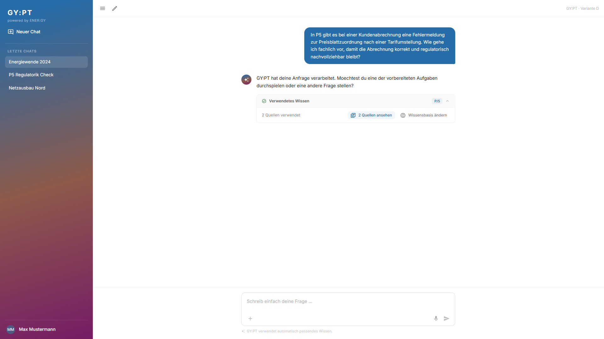
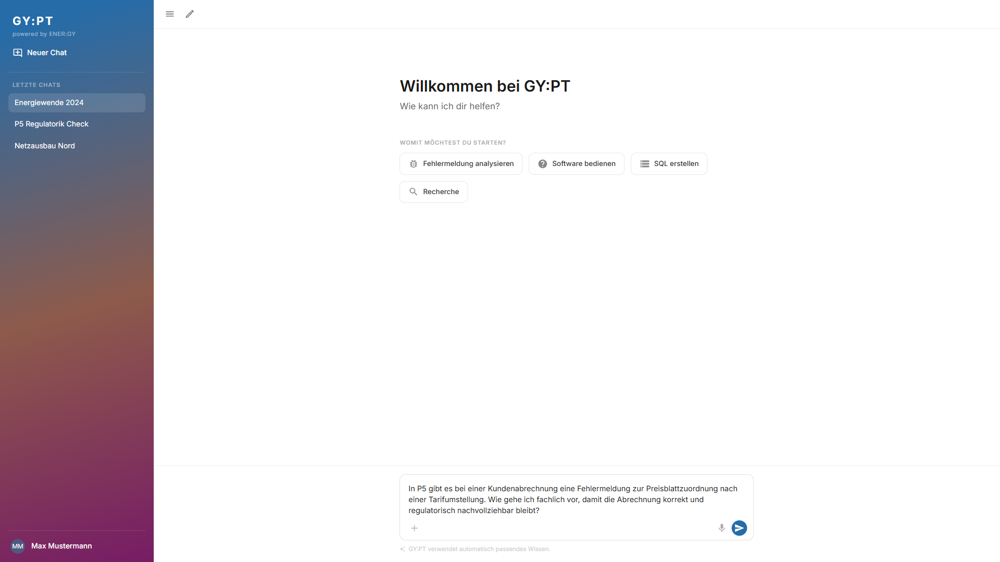
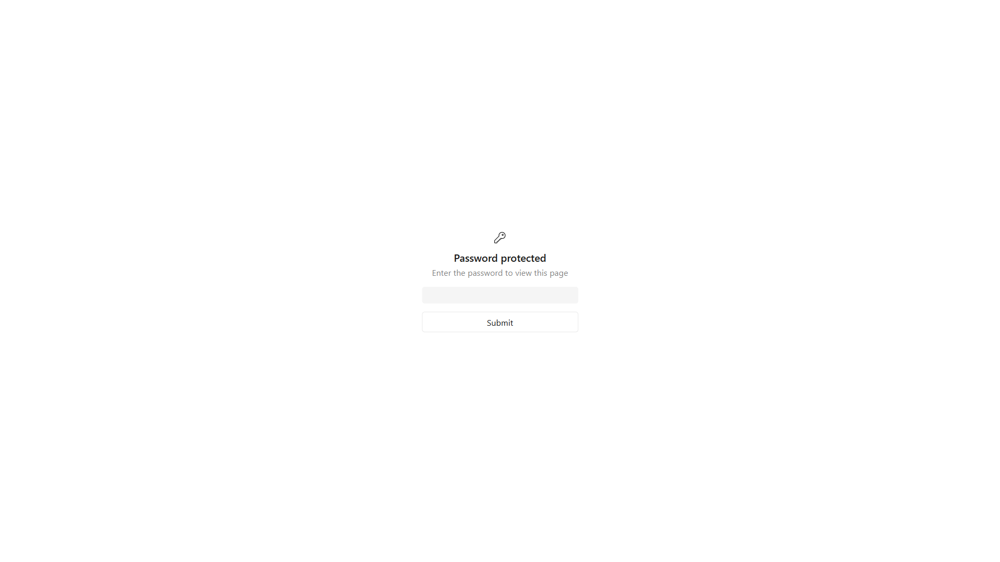

# Testreport: Alexander Reuter — 2026-09-07

## Zusammenfassung
- **Getestete Journey:** user-journey-gypt
- **URL:** https://break-smart-59600761.figma.site
- **Datum:** 2026-09-07
- **Persona:** Alexander Reuter
- **Ergebnis:** ⚠️ Mit Problemen
- **Dauer:** 1m 50s
- **Playwright-Aktionen:** 21

## Gesamteindruck aus Sicht der Persona
> Als Alexander Reuter finde ich den Startscreen grundsaetzlich verstaendlich: Ich kann direkt eine Frage stellen und muss keine technische Quellen- oder Capability-Struktur verstehen. Die fachnahen Einstiege wie "Fehlermeldung analysieren" passen gut zu meiner Arbeit in P5. Kritisch ist aber, dass die freie Antwort auf eine konkrete Abrechnungs- und Regulatorikfrage nur generisch bleibt und keine praktisch verwertbare Vorgehensweise liefert. Die Transparenz ueber "Verwendetes Wissen" ist ein guter Ansatz, aber Quellen und Wissensbasissteuerung bleiben zu wenig nachvollziehbar.

## Gefundene Probleme

### Problem 1: Antwort beantwortet konkrete Fachfrage nicht
- **Schweregrad:** Kritisch
- **Schritt:** Schritt 5
- **Erwartet:** Alexander erwartet eine konkrete, fachlich belastbare Vorgehensweise zur Preisblattzuordnung nach Tarifumstellung, inklusive Abrechnungspruefung und regulatorischer Nachvollziehbarkeit.
- **Tatsaechlich:** Die Antwort lautet nur: "GY:PT hat deine Anfrage verarbeitet. Moechtest du eine der vorbereiteten Aufgaben durchspielen oder eine andere Frage stellen?"
- **Reaktion der Persona:** Alexander wuerde das Ergebnis fuer seine Abrechnungsaufgabe nicht verwenden koennen und muesste erneut formulieren oder auf andere Quellen ausweichen.
- **Screenshot:** 

### Problem 2: Quellenansicht oeffnet keine sichtbaren Details
- **Schweregrad:** Mittel
- **Schritt:** Schritt 6
- **Erwartet:** Nach Klick auf "2 Quellen ansehen" werden konkrete Quellen oder Dokumente sichtbar, damit die verwendete Wissensbasis nachvollziehbar ist.
- **Tatsaechlich:** Der Zustand bleibt unveraendert; es erscheinen keine sichtbaren Quellendetails.
- **Reaktion der Persona:** Fuer einen Abteilungsleiter Abrechnung ist das zu wenig pruefbar, besonders bei regulatorisch relevanten Aussagen.
- **Screenshot:** 

### Problem 3: Wissensbasis aendern fuehrt zurueck statt Auswahl zu zeigen
- **Schweregrad:** Mittel
- **Schritt:** Schritt 6
- **Erwartet:** "Wissensbasis aendern" bietet eine Auswahl relevanter Wissensraeume wie P5, Regulatorik oder interne Quellen.
- **Tatsaechlich:** Der Klick fuehrt zurueck in einen Start-/Eingabezustand mit der alten Frage im Feld; eine Auswahl ist nicht sichtbar.
- **Reaktion der Persona:** Alexander verliert Kontext und Kontrolle. Er wuerde unsicher, ob Regulatorik wirklich beruecksichtigt wurde.
- **Screenshot:** 

### Problem 4: Einstieg ist passwortgeschuetzt
- **Schweregrad:** Gering
- **Schritt:** Schritt 2
- **Erwartet:** GY:PT ist direkt erreichbar, sofern der Nutzer Zugriff hat.
- **Tatsaechlich:** Vor dem Startscreen erscheint ein Figma-Sites-Passwortschutz.
- **Reaktion der Persona:** Im echten Produktkontext waere ein vorgelagertes Passwort ohne SSO oder Organisationskontext irritierend; fuer den Prototyp ist es akzeptabel.
- **Screenshot:** 

## Durchgeführte Schritte

| Schritt | Beschreibung | Status | Anmerkung |
|---------|-------------|--------|-----------|
| 1 | Unterstuetzungsbedarf aus P5-Kontext angenommen: Fehler bei Preisblattzuordnung nach Tarifumstellung. | ✅ | Szenario passt zu Alexanders Rolle in der Abrechnung. |
| 2 | GY:PT geoeffnet und Startscreen geprueft. | ✅ | Passwortschutz passiert; danach neutraler Startscreen mit Prompt, Tasks und Wissensquellen-Button sichtbar. |
| 3 | Fachliches Anliegen in natuerlicher Sprache eingegeben. | ✅ | Keine technische Quellenwahl erforderlich. |
| 4 | Automatische Wissenszuordnung beobachtet. | ⚠️ | Hinweis "GY:PT verwendet automatisch passendes Wissen" sichtbar; konkrete Routing-Logik nicht sichtbar. |
| 5 | Antwort gelesen und bewertet. | ❌ | Antwort ist generisch und fachlich nicht nutzbar. |
| 6 | "Verwendetes Wissen", Quellen und Wissensbasis-Aenderung geprueft. | ⚠️ | P/5 und "2 Quellen verwendet" sichtbar, aber keine Details nach Klick. |
| 7 | Anwendbarkeit auf P5-Arbeit bewertet. | ❌ | Ergebnis reicht nicht fuer eine reale Abrechnungsentscheidung. |
| Edge Case | Task "Fehlermeldung analysieren" getestet. | ✅ | Task Guidance fragt gezielt nach Fehlercode oder Fehlertext und wirkt hilfreich. |

## Erfolgskriterien

| Kriterium | Erfüllt? | Anmerkung |
|-----------|----------|-----------|
| Der Nutzer kann sein fachliches Anliegen ohne technische Quellen- oder Capability-Kenntnisse starten | ✅ | Freier Prompt ist sichtbar und nutzbar. |
| Prompt First funktioniert als verständlicher Default | ✅ | Eingabefeld ist klar primaerer Einstieg. |
| Optionale Tasks unterstützen nur dann, wenn zusätzliche Guidance benötigt wird, und erzeugen keine Pflichtklassifikation | ✅ | Tasks sind sichtbar, aber nicht verpflichtend; "Fehlermeldung analysieren" gibt sinnvolle Guidance. |
| Eigene Wissensquellen können bei Bedarf berücksichtigt bzw. gezielt gesteuert werden, ohne den Standardfall zu belasten | ❌ | Wissensquellen-Auswahl bzw. Aenderung war nicht nachvollziehbar sichtbar. |
| GY:PT kann relevante Wissensräume automatisch bestimmen und bei Bedarf kombinieren | ⚠️ | P/5 wird angezeigt; Regulatorik wurde trotz Anfrage nicht sichtbar kombiniert. |
| "Verwendetes Wissen" ist verständlich und unterstützt die Nachvollziehbarkeit der Antwort | ⚠️ | Bereich ist auffindbar, aber Quellen lassen sich nicht sichtbar einsehen. |
| Der Nutzer kann die erhaltene Information für seine eigentliche Arbeit verwenden | ❌ | Die Antwort enthaelt keine umsetzbare fachliche Anleitung. |
| Keine kritische Interaktion zwingt den Nutzer dazu, die technische Architektur von GY:PT zu verstehen | ✅ | Keine technischen Begriffe oder Routing-Kenntnisse erforderlich. |

## Empfehlungen
- Freie Antworten muessen eine konkrete fachliche Handlungsanleitung liefern, nicht nur auf Tasks verweisen.
- Bei regulatorisch relevanten Fragen sollte sichtbar werden, ob P5, Regulatorik und ggf. interne Quellen gemeinsam verwendet wurden.
- "2 Quellen ansehen" sollte konkrete Quellen, Titel, kurze Auszuege oder zumindest Wissensraum-Details oeffnen.
- "Wissensbasis aendern" sollte eine klare Auswahl oder ein Panel anzeigen und den bestehenden Chatkontext erhalten.
- Der Task "Fehlermeldung analysieren" ist ein guter Ansatz; er sollte nach Eingabe eines Fehlertexts eine echte Analyse mit naechsten Pruefschritten liefern.
