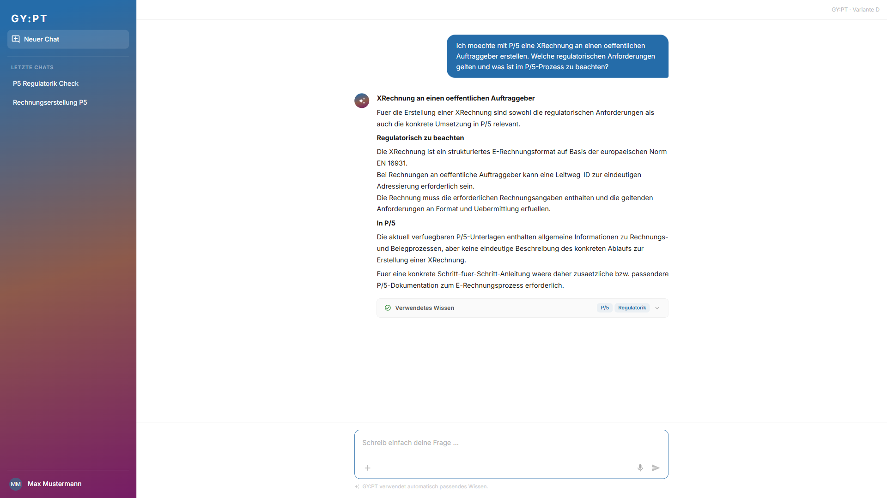

# Testreport: Alexander Reuter - 2026-09-08

## Zusammenfassung
- **Getestete Journey:** user-journey-gypt-p5
- **URL:** https://break-smart-59600761.figma.site
- **Datum:** 2026-09-08
- **Persona:** Alexander Reuter
- **Ergebnis:** ✅ Bestanden
- **Dauer:** 2m 33s
- **Playwright-Aktionen:** 23

## Gesamteindruck aus Sicht der Persona
> Alexander findet den Einstieg schnell, weil der freie Prompt prominent ist und keine technische Vorauswahl verlangt. Als Abteilungsleiter mit Prozess- und Regulierungsverantwortung bewertet er positiv, dass GY:PT P/5, eigene Wissensquellen und Regulatorik sichtbar unterscheidet. Der Task "Fehlermeldung analysieren" passt gut zu einer operativen Stoerung und reduziert Rueckfragen. Kritisch sieht Alexander, dass interne Kommunikationsvorgaben und der P/5-Teil zur XRechnung fuer Steuerung, Compliance und Prozesssicherheit noch zu wenig konkret sind.

## Gefundene Probleme

### Problem 1: Interne Kommunikationsvorgaben sind fuer Fuehrungs- und Prozesssicht zu knapp
- **Schweregrad:** Gering
- **Schritt:** Aufgabe 2
- **Erwartet:** Alexander erwartet konkrete Vorgaben, Prozessschritte oder mindestens einen klaren Verweis auf die relevante interne Arbeitsanweisung, damit die Kundenkommunikation einheitlich und nachvollziehbar bleibt.
- **Tatsächlich:** GY:PT erkennt "Eigene Wissensquellen" korrekt, nennt aber nur allgemein, dass Grund, Aenderung und weitere Kundenschritte erklaert werden sollen.
- **Reaktion der Persona:** Alexander wuerde die Antwort als brauchbaren ersten Hinweis sehen, aber fuer verbindliche Teamsteuerung nach konkreteren Standards, Textbausteinen oder Eskalationsregeln fragen.
- **Screenshot:** 

### Problem 2: XRechnung beantwortet Regulatorik, aber nicht den konkreten P/5-Prozess
- **Schweregrad:** Mittel
- **Schritt:** Aufgabe 4
- **Erwartet:** Alexander erwartet regulatorische Eckpunkte und eine belastbare Aussage, wie der Prozess in P/5 umgesetzt wird oder welche Systemvoraussetzungen betroffen sind.
- **Tatsächlich:** GY:PT kombiniert P/5 und Regulatorik korrekt, sagt aber, dass die verfuegbaren P/5-Unterlagen keine eindeutige Schritt-fuer-Schritt-Anleitung enthalten.
- **Reaktion der Persona:** Alexander schaetzt die transparente Lueckenbenennung, bekommt daraus aber keine ausreichende Planungssicherheit fuer Prozessumsetzung oder Teamkommunikation.
- **Screenshot:** 

## Durchgeführte Schritte

| Schritt | Beschreibung | Status | Anmerkung |
|---------|-------------|--------|-----------|
| Aufgabe 1 | Eingangsrechnung in P/5 finden; freie Frage "Wo finde ich eingegangene Rechnungen in P/5?" | ✅ | Antwort nennt "Uebersicht Eingangsrechnungen (CE9I)" und relevante Suchfilter |
| Aufgabe 2 | Interne Vorgaben zur Kundenkommunikation; freie Frage mit explizitem Hinweis auf interne Vorgaben | ✅ | Routing auf "Eigene Wissensquellen" funktioniert; Antwort bleibt knapp |
| Aufgabe 3 | Fehlercode ERIF; Einstieg ueber Task "Fehlermeldung analysieren" | ✅ | Antwort nennt ERIF als ungueltige Funktion, O/C/R/W und Korrekturvorgehen |
| Aufgabe 4 | XRechnung fuer oeffentlichen Auftraggeber; freie fachuebergreifende Frage | ✅ | Routing kombiniert P/5 und Regulatorik; P/5-Schrittfolge fehlt |

## Beobachtungsschema

| Aufgabe | Erste Handlung | Einstieg | Begründung / Zitat | Irritationen | Interpretation |
|---|---|---|---|---|---|
| 1 | Direkte Eingabe in den Prompt | Prompt | "Das ist eine Produktfrage, die sollte GY:PT direkt beantworten koennen." | Keine | Prompt First funktioniert fuer einfache P/5-Fragen |
| 2 | Direkte Eingabe mit explizitem Verweis auf interne Vorgaben | Prompt mit Kontext | "Wenn interne Standards gelten, nenne ich das gleich in der Frage." | Antwort ist nicht verbindlich genug | Automatisches Routing passt, Detailtiefe fuer Prozesssteuerung ist begrenzt |
| 3 | Klick auf "Fehlermeldung analysieren" | Task | "Bei einem Fehlercode ist eine gefuehrte Diagnose effizienter." | Keine | Task Entry Point liefert bei Stoerungen klaren Mehrwert |
| 4 | Direkte Eingabe ohne manuelle Quellenwahl | Prompt | "P/5 und Regulatorik muss das System zusammenfuehren." | P/5-Umsetzung bleibt offen | Multi-Source-Routing staerkt Vertrauen, reicht ohne konkrete Prozessdetails aber nicht voll aus |

## Erfolgskriterien

| Kriterium | Erfüllt? | Anmerkung |
|-----------|----------|-----------|
| Die Nutzerin kann ihr fachliches Anliegen ohne Wissen ueber technische Quellen oder Capabilities beginnen | ✅ | Alexander konnte alle Aufgaben ohne technische Routingbegriffe starten |
| Prompt First funktioniert als verständlicher und niedrigschwelliger Default | ✅ | Aufgaben 1, 2 und 4 wurden direkt ueber freie Eingabe bearbeitet |
| Tasks liefern nur dann zusätzliche Orientierung, wenn sie tatsächlich benötigt wird | ✅ | Der Fehleranalyse-Task war fuer ERIF passend und hilfreich |
| `+` wird als optionale Kontrolle verstanden und nicht wie notwendige Konfiguration | ✅ | Keine Aufgabe erforderte manuelle Quellenwahl |
| Organisationsspezifisches Wissen wird automatisch berücksichtigt oder gezielt steuerbar | ✅ | Aufgabe 2 zeigte "Eigene Wissensquellen" |
| GY:PT kann mehrere relevante Wissensräume automatisch kombinieren | ✅ | Aufgabe 4 zeigte "P/5" und "Regulatorik" gemeinsam |
| `Verwendetes Wissen` ist verständlich und schafft Nachvollziehbarkeit | ✅ | Die Wissensraeume waren sichtbar und fuer Alexander fachlich plausibel |
| Die Nutzerin findet in allen vier Situationen einen nachvollziehbaren Einstieg | ✅ | Einstiege passten jeweils zu Produktfrage, interner Vorgabe, Fehlerdiagnose und Regulatorikfrage |

## Empfehlungen
- Antworten aus internen Wissensquellen sollten konkretere Prozessverweise, Rollen oder Kommunikationsbausteine enthalten.
- Bei regulatorischen Themen sollte GY:PT klar trennen zwischen gesicherter Anforderung, P/5-Unterstuetzung und fehlender Produktdokumentation.
- Fuer Fuehrungskraefte wie Alexander waeren Hinweise auf Prozessauswirkung, Compliance-Risiko und naechste Klaerungsschritte besonders wertvoll.
