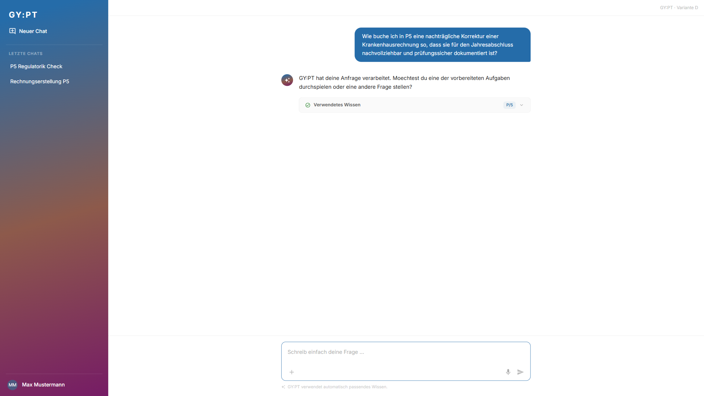
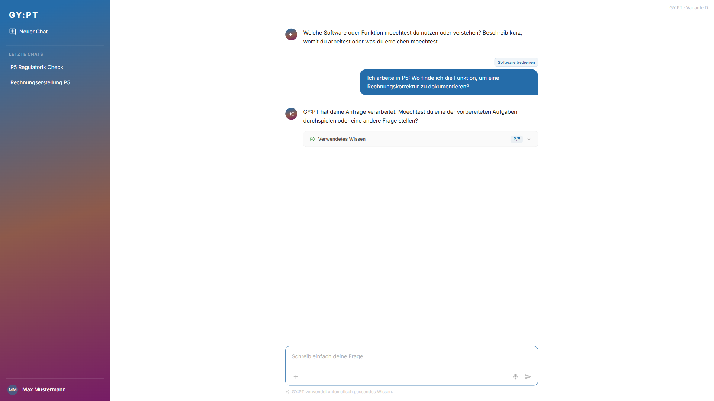
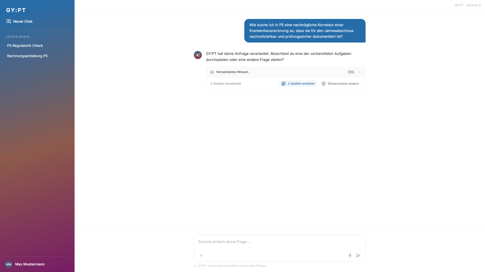
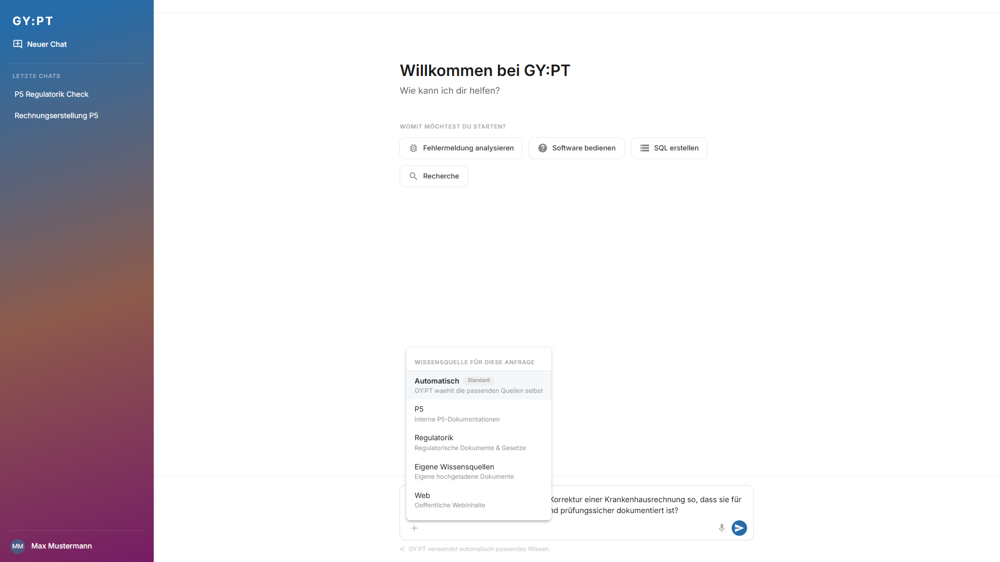

# Testreport: Samira Fuchs - 2026-09-08

## Zusammenfassung
- **Getestete Journey:** user-journey-gypt
- **URL:** https://break-smart-59600761.figma.site
- **Datum:** 2026-09-08
- **Persona:** Samira Fuchs
- **Ergebnis:** ⚠️ Mit Problemen
- **Dauer:** 2m 22s
- **Playwright-Aktionen:** 22

## Gesamteindruck aus Sicht der Persona
> Der Einstieg wirkt fuer Samira zunaechst klar: Sie kann direkt eine fachliche Frage eingeben und sieht, dass GY:PT automatisch passendes Wissen verwenden soll. Die Wissensquellenauswahl ist als optionaler Zusatz verstaendlich und belastet den Standardfall nicht. Frustrierend ist aber, dass sowohl freie Frage als auch Task-Modus nur eine generische Systemantwort liefern, ohne die konkrete P5-/Buchhaltungsfrage zu beantworten. Fuer eine buchhalterisch und revisionssicher denkende Fachanwenderin reicht die Quellen-Transparenz nicht aus, weil zwar "2 Quellen verwendet" erscheint, aber keine Detailquellen sichtbar werden.

## Gefundene Probleme

### Problem 1: Fachliche Anfrage wird nicht beantwortet
- **Schweregrad:** Kritisch
- **Schritt:** Schritt 5
- **Erwartet:** Samira erwartet eine konkrete, fachlich nutzbare Antwort zur nachtraeglichen Rechnungskorrektur in P5 mit nachvollziehbarer Dokumentation fuer Jahresabschluss und Pruefung.
- **Tatsächlich:** GY:PT antwortet nur: "GY:PT hat deine Anfrage verarbeitet. Moechtest du eine der vorbereiteten Aufgaben durchspielen oder eine andere Frage stellen?"
- **Reaktion der Persona:** Samira waere irritiert und wuerde das Tool fuer ihren Arbeitsfall nicht als verlaessliche Unterstuetzung ansehen, weil keine verwertbare Buchungs- oder Bedieninformation geliefert wird.
- **Screenshot:** 

### Problem 2: Task Guidance fuehrt ebenfalls nicht zu verwertbarer Hilfe
- **Schweregrad:** Kritisch
- **Schritt:** Schritt 5
- **Erwartet:** Der Task "Software bedienen" sollte Samira durch eine P5-Bedienfrage fuehren und eine konkrete Orientierung liefern, wo bzw. wie die Rechnungskorrektur dokumentiert wird.
- **Tatsächlich:** Auch im Task-Modus wird nur dieselbe generische Antwort angezeigt.
- **Reaktion der Persona:** Samira wuerde den Task als Scheinunterstuetzung wahrnehmen: Er fragt zwar besser nach, liefert danach aber keinen Mehrwert.
- **Screenshot:** 

### Problem 3: Quellenliste laesst sich nicht nachvollziehbar oeffnen
- **Schweregrad:** Mittel
- **Schritt:** Schritt 6
- **Erwartet:** Nach Klick auf "2 Quellen ansehen" erwartet Samira konkrete Quellen oder Dokumenttitel, um die Antwort fachlich und revisionsnah einordnen zu koennen.
- **Tatsächlich:** Die Anzeige bleibt bei "2 Quellen verwendet"; der Button erhaelt Fokus, aber es werden keine Detailquellen sichtbar.
- **Reaktion der Persona:** Samira haette weniger Vertrauen in die Antwortbasis, besonders bei regulatorisch oder jahresabschlussrelevanten Fragen.
- **Screenshot:** 

### Problem 4: "Wissensbasis ändern" setzt den Chat-Kontext unerwartet zurueck
- **Schweregrad:** Mittel
- **Schritt:** Schritt 6
- **Erwartet:** Samira erwartet, die verwendete Wissensbasis fuer die bestehende Anfrage anzupassen oder zumindest eine klare Auswahl im aktuellen Kontext zu sehen.
- **Tatsächlich:** Die Oberflaeche springt zurueck auf den Startscreen; der alte Prompt bleibt im Eingabefeld stehen.
- **Reaktion der Persona:** Das wirkt wie ein Zustandsbruch und erzeugt Unsicherheit, ob ihre vorherige Frage noch beruecksichtigt wird.
- **Screenshot:** 

## Durchgeführte Schritte

| Schritt | Beschreibung | Status | Anmerkung |
|---------|-------------|--------|-----------|
| 1 | Unterstuetzungsbedarf aus Samiras P5-Arbeit abgeleitet: Rechnungskorrektur pruefungssicher dokumentieren | ✅ | Persona-konformer Bedarf mit Buchhaltungs- und Revisionsbezug |
| 2 | GY:PT geoeffnet und Startscreen bewertet | ✅ | Prompt ist sichtbar, Task-Einstiege sind optional wahrnehmbar |
| 3 | Fachliche Anfrage frei formuliert | ✅ | Keine technische Quellen- oder Capability-Auswahl erforderlich |
| 4 | Automatische Wissenszuordnung beobachtet | ⚠️ | "P/5" wird angezeigt, aber keine nachvollziehbare fachliche Verarbeitung erkennbar |
| 5 | Antwort gelesen und bewertet | ❌ | Antwort bleibt generisch und beantwortet die konkrete Frage nicht |
| 6 | "Verwendetes Wissen" und Quellenansicht geprueft | ⚠️ | Quellenmenge sichtbar, Detailquellen nicht sichtbar; Wissensbasis-Aenderung bricht Kontext |
| 7 | Anwendbarkeit fuer P5-Arbeit bewertet | ❌ | Keine ausreichende Information, um die eigentliche Arbeit fortzusetzen |

## Erfolgskriterien

| Kriterium | Erfüllt? | Anmerkung |
|-----------|----------|-----------|
| Der Nutzer kann sein fachliches Anliegen ohne technische Quellen- oder Capability-Kenntnisse starten | ✅ | Freier Prompt funktioniert als Einstieg |
| Prompt First funktioniert als verständlicher Default | ✅ | Eingabefeld ist primaer und Hinweis auf automatische Wissenswahl ist sichtbar |
| Optionale Tasks unterstützen nur dann, wenn zusätzliche Guidance benötigt wird, und erzeugen keine Pflichtklassifikation | ⚠️ | Tasks wirken optional und die Leitfrage hilft, aber die anschliessende Antwort liefert keinen Nutzwert |
| Eigene Wissensquellen können bei Bedarf berücksichtigt bzw. gezielt gesteuert werden, ohne den Standardfall zu belasten | ✅ | Plus-Menue zeigt Automatisch, P5, Regulatorik, eigene Wissensquellen und Web |
| GY:PT kann relevante Wissensräume automatisch bestimmen und bei Bedarf kombinieren | ⚠️ | P5 wird angezeigt; Kombination mit Regulatorik fuer die fachuebergreifende Frage ist nicht erkennbar |
| "Verwendetes Wissen" ist verständlich und unterstützt die Nachvollziehbarkeit der Antwort | ⚠️ | Bereich ist auffindbar, aber Detailquellen werden nicht sichtbar |
| Der Nutzer kann die erhaltene Information für seine eigentliche Arbeit verwenden | ❌ | Die Antwort enthaelt keine konkrete fachliche oder operative Hilfestellung |
| Keine kritische Interaktion zwingt den Nutzer dazu, die technische Architektur von GY:PT zu verstehen | ✅ | Technische Begriffe werden vermieden; Quellensteuerung bleibt optional |

## Empfehlungen
- Freie fachliche Prompts muessen eine inhaltliche Antwort liefern, nicht nur eine generische Prozessmeldung.
- Task-Modi sollten nach der Leitfrage eine konkrete, taskbezogene Antwort erzeugen.
- "2 Quellen ansehen" sollte konkrete Dokumente, Wissensraeume oder Quellenkarten oeffnen.
- "Wissensbasis ändern" sollte im bestehenden Anfragekontext bleiben oder klar anzeigen, dass ein neuer Anfragezustand begonnen wird.
- Bei fachuebergreifenden P5-/Regulatorik-Fragen sollte sichtbar werden, ob nur P5 oder auch regulatorisches Wissen verwendet wurde.
