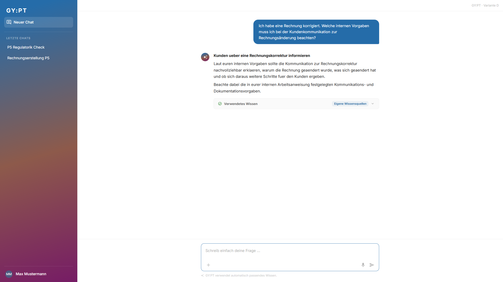
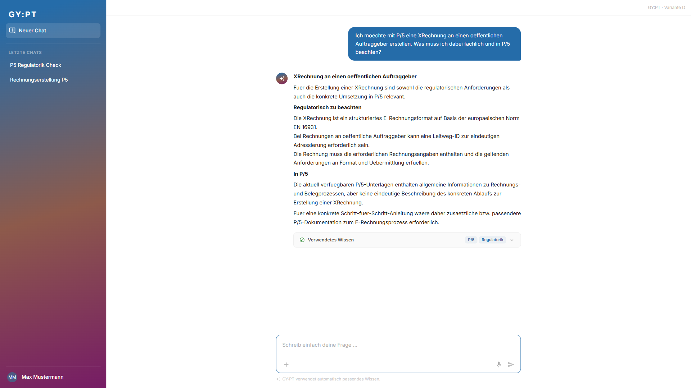

# Testreport: Samira Fuchs - 2026-09-08

## Zusammenfassung
- **Getestete Journey:** user-journey-gypt-p5
- **URL:** https://break-smart-59600761.figma.site
- **Datum:** 2026-09-08
- **Persona:** Samira Fuchs
- **Ergebnis:** ✅ Bestanden
- **Dauer:** 1m 21s
- **Playwright-Aktionen:** 24

## Gesamteindruck aus Sicht der Persona
> Samira findet sich auf dem Startscreen schnell zurecht, weil der freie Prompt klar als Standard wirkt und keine technische Vorauswahl verlangt. Fuer einfache P/5-Fragen und die fachuebergreifende XRechnungs-Frage vertraut sie der automatischen Wissensauswahl; bei internen Vorgaben beschreibt sie den Kontext direkt im Prompt. Der Task "Fehlermeldung analysieren" wirkt in der ERIF-Situation hilfreich, weil er genau zu einer akuten Problemsituation passt. Aus Samiras Sicht ist das Konzept insgesamt brauchbar, mit leichtem Abzug bei der teils allgemeinen Antwort zu internen Vorgaben und der offen benannten P/5-Dokumentationsluecke bei XRechnung.

## Gefundene Probleme

### Problem 1: Interne Vorgaben bleiben recht allgemein
- **Schweregrad:** Gering
- **Schritt:** Aufgabe 2
- **Erwartet:** Samira erwartet bei internen Kommunikationsvorgaben moeglichst konkrete Handlungsschritte oder klare Verweise auf interne Arbeitsanweisungen.
- **Tatsächlich:** GY:PT erkennt "Eigene Wissensquellen" korrekt und liefert eine plausible Antwort, bleibt aber allgemein bei Begruendung, Aenderung und weiteren Schritten.
- **Reaktion der Persona:** Samira koennte damit starten, wuerde fuer eine revisionssichere Kundenkommunikation aber wahrscheinlich noch nach konkreten Formulierungen oder Prozessdetails fragen.
- **Screenshot:** 

### Problem 2: P/5-Ablauf fuer XRechnung nicht konkret verfuegbar
- **Schweregrad:** Gering
- **Schritt:** Aufgabe 4
- **Erwartet:** Samira erwartet neben regulatorischen Anforderungen auch konkrete P/5-Bedienschritte zur Erstellung einer XRechnung.
- **Tatsächlich:** GY:PT kombiniert P/5 und Regulatorik korrekt, weist aber darauf hin, dass die verfuegbaren P/5-Unterlagen keine eindeutige Schritt-fuer-Schritt-Anleitung enthalten.
- **Reaktion der Persona:** Samira wuerde die ehrliche Lueckenbenennung schaetzen, muesste fuer die operative Umsetzung aber weitere Dokumentation oder Support nutzen.
- **Screenshot:** 

## Durchgeführte Schritte

| Schritt | Beschreibung | Status | Anmerkung |
|---------|-------------|--------|-----------|
| Aufgabe 1 | Eingangsrechnung in P/5 finden; freie Frage "Wo finde ich eingegangene Rechnungen in P/5?" | ✅ | Antwort nennt "Uebersicht Eingangsrechnungen (CE9I)" und relevante Filter |
| Aufgabe 2 | Interne Vorgaben zur Kundenkommunikation; freie Frage mit explizitem Kontext "interne Vorgaben" | ✅ | Automatisches Routing auf "Eigene Wissensquellen"; Antwort brauchbar, aber allgemein |
| Aufgabe 3 | Fehlercode ERIF; Einstieg ueber Task "Fehlermeldung analysieren" | ✅ | Task-Leitfrage passt; Antwort erklaert ERIF, zulaessige Funktionen O, C, R, W und Korrektur |
| Aufgabe 4 | XRechnung fuer oeffentlichen Auftraggeber; freie fachuebergreifende Frage | ✅ | Automatisches Routing kombiniert P/5 und Regulatorik |

## Beobachtungsschema

| Aufgabe | Erste Handlung | Einstieg | Begründung / Zitat | Irritationen | Interpretation |
|---|---|---|---|---|---|
| 1 | Blick auf Prompt, dann direkte Eingabe | Prompt | "Das ist eine klare P/5-Frage, dafuer muss ich nichts einstellen." | Keine | Prompt First funktioniert fuer einfache Produktfragen sehr gut |
| 2 | Direkte Eingabe mit Kontext "interne Vorgaben" | Prompt mit Kontext | "Wenn ich interne Vorgaben brauche, schreibe ich das direkt in die Frage." | Antwort bleibt etwas allgemein | Automatic Routing zu eigenen Wissensquellen passt zum Mental Model |
| 3 | Klick auf "Fehlermeldung analysieren" | Task | "Bei einem Fehlercode hilft mir eine gefuehrte Eingabe." | Keine | Task Entry Point hat bei Diagnosebedarf klaren Nutzen |
| 4 | Direkte Eingabe ohne Quellenwahl | Prompt | "P/5 und Anforderungen gehoeren zusammen; GY:PT sollte das erkennen." | P/5-Schrittfolge fehlt wegen Dokumentationsluecke | Multi-Source-Routing ist verstaendlich und vertrauensbildend |

## Erfolgskriterien

| Kriterium | Erfüllt? | Anmerkung |
|-----------|----------|-----------|
| Die Nutzerin kann ihr fachliches Anliegen ohne Wissen ueber technische Quellen oder Capabilities beginnen | ✅ | Alle Aufgaben konnten ohne technische Begriffe gestartet werden |
| Prompt First funktioniert als verständlicher und niedrigschwelliger Default | ✅ | Aufgaben 1, 2 und 4 wurden natuerlich ueber freie Frage geloest |
| Tasks liefern nur dann zusätzliche Orientierung, wenn sie tatsächlich benötigt wird | ✅ | Der ERIF-Task passte zur Problemsituation und half bei der Eingabe |
| `+` wird als optionale Kontrolle verstanden und nicht wie notwendige Konfiguration | ✅ | Samira musste `+` nicht nutzen; automatisches Routing reichte |
| Organisationsspezifisches Wissen wird automatisch berücksichtigt oder gezielt steuerbar | ✅ | Aufgabe 2 routete auf "Eigene Wissensquellen" |
| GY:PT kann mehrere relevante Wissensräume automatisch kombinieren | ✅ | Aufgabe 4 zeigte "P/5" und "Regulatorik" gemeinsam |
| `Verwendetes Wissen` ist verständlich und schafft Nachvollziehbarkeit | ✅ | Wissensraeume wurden sichtbar und waren fuer Samira fachlich interpretierbar |
| Die Nutzerin findet in allen vier Situationen einen nachvollziehbaren Einstieg | ✅ | Unterschiedliche Einstiege passten zur jeweiligen Situation |

## Empfehlungen
- Interne Wissensantworten sollten, sofern vorhanden, konkretere Prozessschritte, Textbausteine oder Dokumentverweise anzeigen.
- Bei bekannten Dokumentationsluecken wie XRechnung sollte GY:PT aktiv vorschlagen, welche P/5-Unterlage oder welcher Supportweg fuer die fehlende Schrittfolge benoetigt wird.
- Der Task "Fehlermeldung analysieren" sollte in der Startansicht erhalten bleiben; er liefert bei Diagnosefaellen erkennbaren Zusatznutzen.
